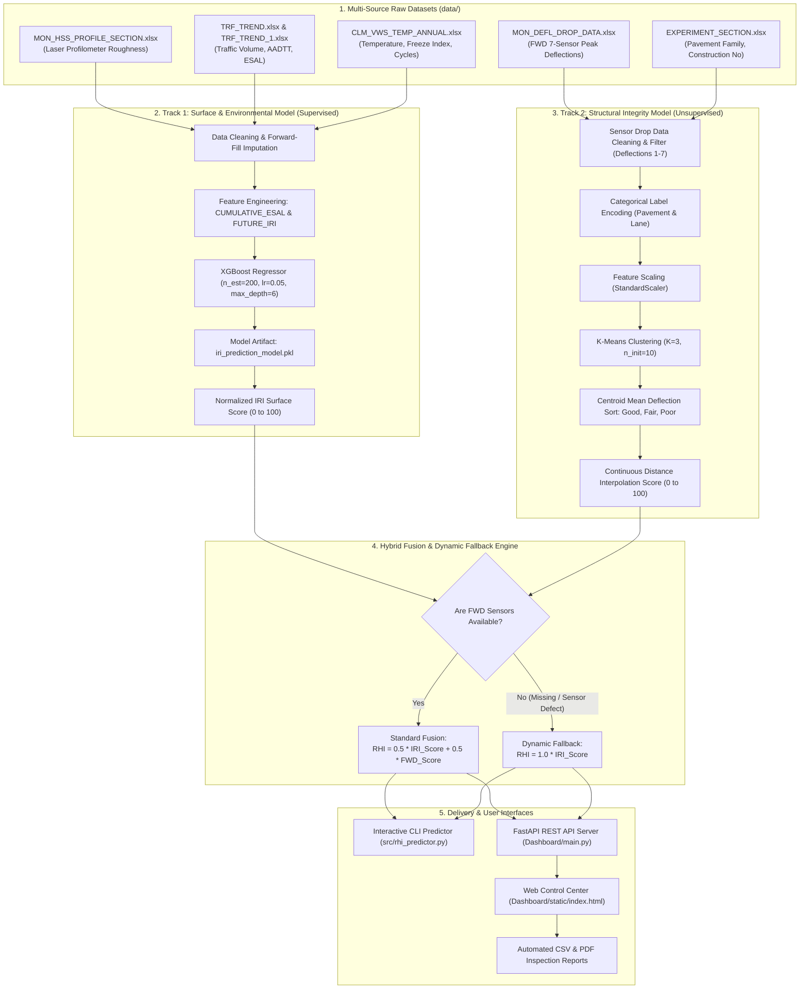

# 🛣️ Road Health Index (RHI) & Pavement Remaining Service Life Prediction System

> **An AI-powered dual-track machine learning platform that evaluates pavement surface roughness, climate deterioration, and subsurface structural integrity to predict road health and guide proactive infrastructure maintenance.**

---

### 👥 Project Metadata & Academic Attribution
* **Academic Institution**: Acharya Institute of Technology
* **Department**: Department of Artificial Intelligence & Machine Learning (AI & ML)
* **Project Group**: Group 18
* **Project Guide**: Mr. Mohammed Tahir Mirji | Assistant Professor
* **Data Origin**: Long-Term Pavement Performance (LTPP) Database — US Federal Highway Administration (FHWA) & Virtual Weather Station (VWS) Climate Data

---

## 📑 Table of Contents
1. [Project Overview & Executive Summary](#1-project-overview--executive-summary)
   * [The Core Problem](#the-core-problem)
   * [The Machine Learning Solution](#the-machine-learning-solution)
   * [Key Engineering Concepts for Beginners](#key-engineering-concepts-for-beginners)
2. [System Architecture & Machine Learning Pipeline](#2-system-architecture--machine-learning-pipeline)
   * [Dual-Track Architecture Flowchart](#dual-track-architecture-flowchart)
   * [Track 1: Model 1 — Surface Roughness, Traffic & Climate (XGBoost Regressor)](#track-1-model-1--surface-roughness-traffic--climate-xgboost-regressor)
   * [Track 2: Model 2 — Structural Health & Sensor Deflections (K-Means Clustering)](#track-2-model-2--structural-health--sensor-deflections-k-means-clustering)
   * [The Fusion Engine: 50/50 Hybrid Index & Dynamic Fallback Architecture](#the-fusion-engine-5050-hybrid-index--dynamic-fallback-architecture)
3. [Mathematical Formulations & Scoring Logic](#3-mathematical-formulations--scoring-logic)
   * [Model 1: Normalized IRI Surface Score Formula](#model-1-normalized-iri-surface-score-formula)
   * [Model 2: Continuous Structural Health Score Formula](#model-2-continuous-structural-health-score-formula)
   * [Composite RHI Fusion Formula](#composite-rhi-fusion-formula)
   * [Pavement Condition & Decision Matrix](#pavement-condition--decision-matrix)
4. [Repository Directory & File Structure](#4-repository-directory--file-structure)
5. [Exhaustive Codebase & Function Catalog](#5-exhaustive-codebase--function-catalog)
   * [Backend Scripts (`src/`)](#backend-scripts-src)
     * [`src/train_model1.py`](#srctrain_model1py)
     * [`src/train_model2.py`](#srctrain_model2py)
     * [`src/rhi_predictor.py`](#srcrhi_predictorpy)
   * [FastAPI Server & Control Center (`Dashboard/`)](#fastapi-server--control-center-dashboard)
     * [`Dashboard/main.py`](#dashboardmainpy)
   * [Frontend Application Stack (`Dashboard/static/`)](#frontend-application-stack-dashboardstatic)
     * [`Dashboard/static/index.html`](#dashboardstaticindexhtml)
     * [`Dashboard/static/app.js`](#dashboardstaticappjs)
     * [`Dashboard/static/styles.css`](#dashboardstaticstylescss)
     * [`Dashboard/static/advanced.css`](#dashboardstaticadvancedcss)
     * [`Dashboard/static/form-helpers.css`](#dashboardstaticform-helperscss)
   * [Research & Exploration Notebooks (`notebooks/`)](#research--exploration-notebooks-notebooks)
     * [`notebooks/model1.ipynb`](#notebooksmodel1ipynb)
     * [`notebooks/model2.ipynb`](#notebooksmodel2ipynb)
     * [`notebooks/RHI_Score.ipynb`](#notebooksrhi_scoreipynb)
   * [Verification & Testing (`testing/`)](#verification--testing-testing)
     * [`testing/test_rhi_score.ipynb`](#testingtest_rhi_scoreipynb)
   * [Datasets Catalog (`data/`)](#datasets-catalog-data)
   * [Trained Model Artifacts (`models/`)](#trained-model-artifacts-models)
   * [Generated Output Artifacts (`outputs/` & `outputs_test/`)](#generated-output-artifacts-outputs--outputs_test)
6. [REST API Documentation & Endpoints Reference](#6-rest-api-documentation--endpoints-reference)
7. [User Workflows & Operational Guides](#7-user-workflows--operational-guides)
8. [Comprehensive Domain & Technical Glossary](#8-comprehensive-domain--technical-glossary)

---

## 1. Project Overview & Executive Summary

### The Core Problem
Highways and urban roads are critical economic lifelines, but they continuously deteriorate under two relentless forces:
1. **Mechanical Stress**: Heavy commercial traffic and repetitive axle loading weaken structural layers over time.
2. **Environmental & Climate Stress**: Seasonal thermal expansion, annual freeze-thaw cycles, and sub-zero freeze indices cause micro-cracks, surface raveling, and asphalt oxidation.

Traditional road assessment relies on manual visual inspections or delayed municipal surveys. This manual approach is:
* **Slow & Dangerous**: Inspectors must walk or drive along high-speed corridors.
* **Subjective**: Different human inspectors assign varying condition scores to the same stretch of highway.
* **Reactive Instead of Proactive**: Repairs are scheduled only after visible potholes and structural failures occur, costing up to **5× more** than preventive maintenance.

### The Machine Learning Solution
This project introduces an end-to-end, automated machine learning platform that computes a standardized **Road Health Index (RHI)** on a scale from **0 to 100**.

By combining **Non-Destructive Testing (NDT)** data with historical traffic trends and annual climate observations from the **FHWA Long-Term Pavement Performance (LTPP)** database, the system:
1. Predicts future surface roughness deterioration using supervised regression.
2. Clusters subsurface structural deflection profiles using unsupervised machine learning.
3. Fuses both metrics into a unified index that prescribes concrete engineering actions: **Good** (routine maintenance), **Fair** (scheduled repair), or **Poor** (urgent structural intervention).

```
                      ┌───────────────────────────────────────────────────────────┐
                      │              LTPP Multi-Source Raw Datasets               │
                      │  (Profile Scans, Traffic Counts, FWD Sensors, Climate)    │
                      └─────────────────────────────┬─────────────────────────────┘
                                                    │
                         ┌──────────────────────────┴──────────────────────────┐
                         ▼                                                     ▼
        ┌───────────────────────────────────┐                 ┌───────────────────────────────────┐
        │       TRACK 1: SURFACE & CLIMATE  │                 │    TRACK 2: STRUCTURAL INTEGRITY  │
        │   Supervised XGBoost Regressor    │                 │    Unsupervised K-Means Cluster   │
        │   (MRI, ESAL, Trucks, Freeze)     │                 │   (7 FWD Geophones, Drop Load)    │
        └─────────────────┬─────────────────┘                 └─────────────────┬─────────────────┘
                          │                                                     │
                          │ Computes 0-100 IRI Score                            │ Computes 0-100 Structural Score
                          ▼                                                     ▼
        ┌─────────────────────────────────────────────────────────────────────────────────────────┐
        │                              HYBRID FUSION ENGINE                                       │
        │              Full Data: RHI = 50% IRI Score + 50% Structural Score                      │
        │              Missing FWD Sensor Data: RHI = 100% IRI Score (Dynamic Fallback)           │
        └───────────────────────────────────────────┬─────────────────────────────────────────────┘
                                                    │
                                                    ▼
        ┌─────────────────────────────────────────────────────────────────────────────────────────┐
        │             FINAL ROAD HEALTH INDEX (0-100) & CONDITION CLASSIFICATION                  │
        │             🟢 Good (75-100)  |  🟡 Fair (50-74)  |  🔴 Poor (0-49)                     │
        └─────────────────────────────────────────────────────────────────────────────────────────┘
```

### Key Engineering Concepts for Beginners
If you are new to civil or pavement engineering, here are the essential concepts used throughout the project:

* **NDT (Non-Destructive Testing)**: Methods used to evaluate the physical properties of a road without damaging the asphalt or concrete layers (e.g., laser profilometers and falling weight sensors).
* **IRI (International Roughness Index)**: The worldwide gold standard metric measuring road roughness in meters per kilometer ($\text{m/km}$). A lower IRI indicates a smooth, comfortable ride; a higher IRI indicates a bumpy, deteriorated surface ($> 2.5\text{ m/km}$ is considered failed).
* **MRI (Mean Roughness Index)**: The mathematical average of the IRI measured along the left and right wheelpaths of a lane.
* **FWD (Falling Weight Deflectometer)**: A specialized trailer equipment that drops a heavy weight on the road surface and measures instantaneous subsurface deflections using 7 geophone sensors placed at increasing distances from the load plate.
* **Deflection Basin**: The bowl-shaped curve formed by the 7 FWD geophone sensors. A deep basin indicates a soft or failing pavement base, while a shallow basin indicates high structural stiffness.
* **ESAL (Equivalent Single Axle Load)**: A standard engineering unit that converts the damaging effect of mixed traffic (cars, buses, heavy semi-trucks) into the equivalent number of standard 18,000-pound (80 kN) single-axle passes.
* **Freeze-Thaw Cycle**: When water penetrates pavement cracks, freezes in winter (expanding by ~9%), and thaws in spring. This expansion-thaw cycle fractures the asphalt matrix.
* **Freeze Index**: A cumulative temperature metric indicating the severity and duration of sub-zero temperatures over a given year.

---

## 2. System Architecture & Machine Learning Pipeline

### Dual-Track Architecture Flowchart



---

### Track 1: Model 1 — Surface Roughness, Traffic & Climate (XGBoost Regressor)
* **Goal**: Predict the road's future surface roughness ($\text{FUTURE\_IRI}$) 1 year ahead and convert the prediction into an intuitive 0–100 scale.
* **Why Supervised Learning?** We possess ground-truth historical laser profilometer scans spanning multiple years for hundreds of road sections.
* **Why XGBoost?** Extreme Gradient Boosting handles non-linear interactions between traffic volume growth and climate stress with high fidelity and resistance to overfitting.
* **Features Used (9 Inputs)**:
  1. `MRI`: Current Mean Roughness Index ($\text{m/km}$)
  2. `AADTT_ALL_TRUCKS_TREND`: Average Annual Daily Truck Traffic (trucks/day)
  3. `ANNUAL_TRUCK_VOLUME_TREND`: Total yearly truck count
  4. `ANNUAL_ESAL_TREND`: Yearly Equivalent Single Axle Load damage
  5. `CUMULATIVE_ESAL`: Engineered cumulative sum of all ESAL damage sustained since construction
  6. `YEAR`: Measurement calendar year
  7. `MEAN_ANN_TEMP_AVG`: Mean annual ambient temperature ($^\circ\text{C}$)
  8. `FREEZE_INDEX_YR`: Annual cumulative freezing degree-days ($^\circ\text{C}\cdot\text{days}$)
  9. `FREEZE_THAW_YR`: Number of annual freeze-thaw cycles

---

### Track 2: Model 2 — Structural Health & Sensor Deflections (K-Means Clustering)
* **Goal**: Discover structural health patterns and assign Good, Fair, or Poor structural ratings dynamically from Falling Weight Deflectometer (FWD) load test records.
* **Why Unsupervised Learning?** Real-world road structural health does not come with clean human labels. Traditional supervised models suffered from data leakage and arbitrary human thresholds. K-Means clustering groups roads purely based on physical deformation physics.
* **Features Used (11 Inputs)**:
  1. `PEAK_DEFL_1` to `PEAK_DEFL_7`: Peak subsurface deflections ($\mu\text{m}$) measured at 0 mm, 203 mm, 305 mm, 457 mm, 610 mm, 914 mm, and 1524 mm from the load center.
  2. `DROP_LOAD`: Impulsive impact load applied by the FWD plate.
  3. `DROP_HEIGHT`: Height drop index (1 to 4).
  4. `PAVEMENT_FAMILY_ENC`: Encoded pavement structure (`ACTB` = Asphalt Concrete over Treated Base, `ACUB` = Asphalt Concrete over Untreated Base).
  5. `LANE_NO_ENC`: Encoded lane tested (`F1` = Outer Lane, `F3` = Inner/Passing Lane).
* **Dynamic Centroid Mapping**: Once clusters are formed, the algorithm computes the average deflection across all 7 sensors for each cluster centroid. The cluster with the lowest mean deflection is designated **Good**, the middle cluster is **Fair**, and the cluster with the highest deflection is **Poor**.

---

### The Fusion Engine: 50/50 Hybrid Index & Dynamic Fallback Architecture
Real-world transportation networks often have incomplete records: while surface roughness (IRI) can be scanned quickly from moving survey vans, structural FWD testing requires specialized lane-closure equipment and may be missing for certain sections.

To solve this, our system implements a **Left-Join Dynamic Fallback Engine**:
* **Complete Record (Both IRI and FWD available)**:
  $$\text{RHI} = \left(0.5 \times \text{IRI\_Score}\right) + \left(0.5 \times \text{FWD\_Score}\right)$$
* **Missing Structural Record (FWD unavailable or sensor defective)**:
  $$\text{RHI} = 1.0 \times \text{IRI\_Score} \quad (\text{Dynamic Fallback Engaged})$$

This guarantees that **100% of network segments** can be scored without crashing or discarding valid surface data.

---

## 3. Mathematical Formulations & Scoring Logic

### Model 1: Normalized IRI Surface Score Formula
The Federal Highway Administration (FHWA) considers an IRI exceeding **$2.5\text{ m/km}$** as a structurally failed or critically rough pavement. We normalize the predicted future roughness ($\text{IRI}_{\text{pred}}$) to a 0–100 scale:

$$\text{IRI\_Score} = \text{clip}\left( \frac{2.5 - \text{IRI}_{\text{pred}}}{2.5} \times 100, \quad 0, \quad 100 \right)$$

* If $\text{IRI}_{\text{pred}} = 0.0\text{ m/km}$ (glass-smooth): $\text{Score} = 100.0$
* If $\text{IRI}_{\text{pred}} = 1.25\text{ m/km}$ (standard good road): $\text{Score} = 50.0$
* If $\text{IRI}_{\text{pred}} \ge 2.5\text{ m/km}$ (severe failure): $\text{Score} = 0.0$

---

### Model 2: Continuous Structural Health Score Formula
Instead of assigning a coarse step-function score (e.g. Good=100, Fair=60, Poor=20), our production pipeline calculates a **continuous Euclidean distance score** relative to the K-Means cluster centroids:

Let $d_{\text{Good}}$ be the Euclidean distance in standardized feature space from the test sample to the **Good** cluster centroid, and $d_{\text{Poor}}$ be the distance to the **Poor** cluster centroid:

$$\text{FWD\_Score} = \left( \frac{d_{\text{Poor}}}{d_{\text{Good}} + d_{\text{Poor}}} \right) \times 100$$

* When a sample is very close to the **Good** centroid ($d_{\text{Good}} \to 0$): $\text{FWD\_Score} \to 100.0$
* When a sample is equidistant between both: $\text{FWD\_Score} \approx 50.0$
* When a sample is very close to the **Poor** centroid ($d_{\text{Poor}} \to 0$): $\text{FWD\_Score} \to 0.0$

---

### Composite RHI Fusion Formula

$$\text{RHI} = \begin{cases} 
\dfrac{\text{IRI\_Score} + \text{FWD\_Score}}{2} & \text{if FWD data is available} \\[8pt]
\text{IRI\_Score} & \text{if FWD data is missing (Dynamic Fallback)}
\end{cases}$$

---

### Pavement Condition & Decision Matrix

| RHI Score Range | Condition Rating | Structural Status | Recommended Engineering Action |
| :---: | :---: | :---: | :--- |
| **75.0 – 100.0** | 🟢 **Good** | High structural integrity & smooth surface | Routine inspection, crack sealing, and preventive surface treatments. |
| **50.0 – 74.9** | 🟡 **Fair** | Moderate surface wear or initial structural fatigue | Schedule thin asphalt overlay, micro-surfacing, or localized base patching. |
| **0.0 – 49.9** | 🔴 **Poor** | Severe roughness, deep base failure, or extensive cracking | Immediate structural rehabilitation, deep mill and fill, or full-depth reconstruction. |

---

## 4. Repository Directory & File Structure

Below is the complete file tree of the project workspace:

```
Road-RSL-Prediction/
│
├── Dashboard/                      # Web Application & REST API Service
│   ├── main.py                     # FastAPI Backend Server & Prediction Service
│   └── static/                     # Frontend Assets (HTML5, Vanilla JS, CSS3)
│       ├── index.html              # Dashboard User Interface Layout
│       ├── app.js                  # Frontend Application Logic & Chart.js Controllers
│       ├── styles.css              # Base Modern Design System & Theme Variables
│       ├── advanced.css            # Advanced Responsive Grid, PDF & Gauge Styling
│       └── form-helpers.css        # Interactive Form Control & Switch Helpers
│
├── data/                           # Raw LTPP & Virtual Weather Station Excel Workbooks
│   ├── .gitkeep
│   ├── CLM_VWS_TEMP_ANNUAL.xlsx    # Climate Data (Annual Mean Temp, Freeze Index, Freeze-Thaw)
│   ├── EXPERIMENT_SECTION.xlsx     # Section Metadata & Pavement Family Specifications
│   ├── MON_DEFL_DROP_DATA.xlsx     # Falling Weight Deflectometer (FWD) Sensor Deflections
│   ├── MON_HSS_PROFILE_SECTION.xlsx# High-Speed Profilometer Surface Roughness (MRI) Scans
│   ├── TRF_TREND.xlsx              # Traffic Damage Trend (Annual ESAL Loads)
│   └── TRF_TREND_1.xlsx            # Traffic Volume Trend (Daily AADTT & Annual Truck Volume)
│
├── models/                         # Serialized Machine Learning & Preprocessing Artifacts
│   ├── .gitkeep
│   ├── iri_prediction_model.pkl    # Trained XGBoost Regressor for IRI Surface Prediction
│   ├── fwd_kmeans_model.pkl        # Trained K-Means Clustering Model (K=3)
│   ├── fwd_scaler.pkl              # Fitted StandardScaler for FWD Features
│   ├── fwd_le_pav.pkl              # Fitted LabelEncoder for Pavement Family
│   ├── fwd_le_lane.pkl             # Fitted LabelEncoder for Lane Number
│   └── fwd_health_mapping.pkl      # Dynamic Mapping Dictionary (Cluster Index -> Health Rating)
│
├── notebooks/                      # Exploratory Data Analysis & Model Training Notebooks
│   ├── .gitkeep
│   ├── model1.ipynb                # Supervised Model 1 Development & XGBoost Evaluation
│   ├── model2.ipynb                # Unsupervised Model 2 Development & K-Means Deflection Clustering
│   └── RHI_Score.ipynb             # Dual-Model Fusion Pipeline & Complete Network RHI Analysis
│
├── outputs/                        # Research Artifacts, Analysis Charts & Master RHI Dataset
│   ├── .gitkeep
│   ├── actual_vs_predicted.png     # Scatter Plot of Model 1 Actual vs Predicted Future IRI
│   ├── fwd_kmeans_clusters.png     # 3D/2D Projection of FWD Structural Health Clusters
│   ├── iri_score_distribution.png  # Histogram Distribution of Network IRI Scores
│   ├── rhi_distribution.png        # Bar Distribution of Network RHI Health Ratings
│   └── rhi_scores.csv              # Master Scored Dataset for all 502 LTPP Road Sections
│
├── outputs_test/                   # Verification Test Outputs
│   └── sample_prediction.csv       # Scored Output from the Notebook Sample Test Script
│
├── src/                            # Standalone Production Python Scripts
│   ├── train_model1.py             # CLI Script to Clean Data & Train Supervised Model 1
│   ├── train_model2.py             # CLI Script to Clean Data & Train Unsupervised Model 2
│   └── rhi_predictor.py            # Interactive Terminal CLI Predictor for Custom Roads
│
├── testing/                        # Automated Testing & Verification
│   └── test_rhi_score.ipynb        # Single-Road Verification Test Notebook
│
├── requirements.txt                # Unified Python Dependencies Specification
├── SETUP.md                        # Step-by-Step Beginner Setup & Installation Manual
└── README.md                       # Comprehensive Project Documentation & Function Catalog
```

---

## 5. Exhaustive Codebase & Function Catalog

This section provides a detailed explanation of every file and every function in the codebase.

---

### Backend Scripts (`src/`)

#### [`src/train_model1.py`](file:///c:/Users/rajan/Road-RSL-Prediction/src/train_model1.py)
* **File Purpose**: Loads raw high-speed profiler roughness scans, traffic volume series, annual ESAL loading, and climate temperature records. Preprocesses and engineers longitudinal features, then trains and saves the **XGBoost Surface Deterioration Regressor**.
* **Functions**:
  * `main()`
    * **Role**: Primary execution routine for Model 1 pipeline.
    * **Inputs / Data Read**: Reads [`data/MON_HSS_PROFILE_SECTION.xlsx`](file:///c:/Users/rajan/Road-RSL-Prediction/data/MON_HSS_PROFILE_SECTION.xlsx), [`data/TRF_TREND_1.xlsx`](file:///c:/Users/rajan/Road-RSL-Prediction/data/TRF_TREND_1.xlsx), [`data/TRF_TREND.xlsx`](file:///c:/Users/rajan/Road-RSL-Prediction/data/TRF_TREND.xlsx), and [`data/CLM_VWS_TEMP_ANNUAL.xlsx`](file:///c:/Users/rajan/Road-RSL-Prediction/data/CLM_VWS_TEMP_ANNUAL.xlsx).
    * **Logic Steps**:
      1. Uses `Path(__file__).resolve().parent.parent` for cross-platform, relative root path resolution.
      2. Cleans IRI data by parsing `VISIT_DATE`, extracting `YEAR`, dropping redundant run attributes, and computing mean `MRI` grouped by `['SHRP_ID', 'STATE_CODE', 'CONSTRUCTION_NO', 'YEAR']`.
      3. Merges traffic datasets (`TRF_TREND_1` and `TRF_TREND`) with an outer join to retain maximum historical years.
      4. Merges IRI with traffic via inner join on composite section keys.
      5. Applies **forward-fill imputation (`ffill`)** grouped by section to fill missing yearly traffic metrics without data leakage.
      6. Formats `SHRP_ID` with 4-digit zero-padding (`str.zfill(4)`) and inner joins with annual climate records on `['SHRP_ID', 'STATE_CODE', 'YEAR']`.
      7. Computes engineered feature `CUMULATIVE_ESAL = groupby(...).cumsum()`.
      8. Shifts future roughness 1 step backward (`shift(-1)`) to establish the supervised target `FUTURE_IRI`.
      9. Splits data into 80% train / 20% test partitions using `train_test_split(random_state=42)`.
      10. Fits `XGBRegressor(n_estimators=200, learning_rate=0.05, max_depth=6, random_state=42)`.
      11. Calculates and prints performance metrics ($R^2$ and MAE).
      12. Serializes the trained model to [`models/iri_prediction_model.pkl`](file:///c:/Users/rajan/Road-RSL-Prediction/models/iri_prediction_model.pkl) using `joblib.dump`.

---

#### [`src/train_model2.py`](file:///c:/Users/rajan/Road-RSL-Prediction/src/train_model2.py)
* **File Purpose**: Cleans Falling Weight Deflectometer (FWD) multi-sensor drop test measurements and pavement metadata, normalizes features, trains an **unsupervised K-Means clustering model ($K=3$)**, and dynamically creates the health mapping dictionary based on deflection centroid magnitudes.
* **Functions**:
  * `main()`
    * **Role**: Primary execution routine for Model 2 pipeline.
    * **Inputs / Data Read**: Reads [`data/MON_DEFL_DROP_DATA.xlsx`](file:///c:/Users/rajan/Road-RSL-Prediction/data/MON_DEFL_DROP_DATA.xlsx) and [`data/EXPERIMENT_SECTION.xlsx`](file:///c:/Users/rajan/Road-RSL-Prediction/data/EXPERIMENT_SECTION.xlsx).
    * **Logic Steps**:
      1. Resolves directories and formats `SHRP_ID` with zero-padding.
      2. Drops noisy/redundant deflection channels (`PEAK_DEFL_8`, `PEAK_DEFL_9`, `NON_DECREASING_DEFL`, etc.).
      3. Inner joins deflection drops with pavement structural family metadata on `['SHRP_ID', 'STATE_CODE', 'CONSTRUCTION_NO']` and removes nulls.
      4. Fits `LabelEncoder` on `PAVEMENT_FAMILY` and `LANE_NO`.
      5. Assembles 11 structural features: 7 geophone peak deflections (`PEAK_DEFL_1` to `PEAK_DEFL_7`), `DROP_LOAD`, `DROP_HEIGHT`, `PAVEMENT_FAMILY_ENC`, and `LANE_NO_ENC`.
      6. Fits and applies `StandardScaler` to bring all deflections and loads to zero-mean and unit-variance.
      7. Fits `KMeans(n_clusters=3, random_state=42, n_init=10)`.
      8. **Dynamic Health Mapping**: Calculates mean deflection across all 7 sensors per record, groups by predicted cluster, sorts cluster centroids by ascending average deflection, and dynamically maps:
         * Smallest deflection centroid $\to$ `'Good'`
         * Intermediate deflection centroid $\to$ `'Fair'`
         * Largest deflection centroid $\to$ `'Poor'`
      9. Saves 5 serialized artifacts to [`models/`](file:///c:/Users/rajan/Road-RSL-Prediction/models/): `fwd_kmeans_model.pkl`, `fwd_scaler.pkl`, `fwd_le_pav.pkl`, `fwd_le_lane.pkl`, and `fwd_health_mapping.pkl`.

---

#### [`src/rhi_predictor.py`](file:///c:/Users/rajan/Road-RSL-Prediction/src/rhi_predictor.py)
* **File Purpose**: Interactive command-line interface (CLI) that prompts the user for custom road inputs (roughness, traffic, climate, and optional FWD deflections), calculates Model 1 and Model 2 scores, activates dynamic fallback if needed, and prints formatted road condition diagnostics.
* **Functions**:
  * `main()`
    * **Role**: Terminal user interaction and live inference.
    * **Logic Steps**:
      1. Loads all 6 saved artifacts from [`models/`](file:///c:/Users/rajan/Road-RSL-Prediction/models/); safely alerts if model files are missing.
      2. Prompts user for 9 surface, traffic, and climate variables.
      3. Executes Model 1 prediction: $\text{predicted\_iri} = \text{model1.predict()}$ and computes normalized $\text{IRI\_Score}$.
      4. Prompts user: *"Do you have FWD Deflection data for this section? (y/n)"*.
      5. **If Yes**: Prompts for 7 deflection values ($\mu\text{m}$), drop load, drop height, pavement family, and lane type. Encoders transform categoricals, `StandardScaler` normalizes inputs, `KMeans` predicts the structural cluster, and continuous distance interpolation calculates $\text{FWD\_Score}$.
      6. **If No or Error**: Engages dynamic fallback: sets $\text{RHI} = \text{IRI\_Score}$ and labels FWD as *Fallback Engaged*.
      7. Computes composite $\text{RHI} = (\text{IRI\_Score} + \text{FWD\_Score}) / 2$ (or pure IRI if fallback).
      8. Prints a formatted ASCII result box showing Predicted IRI, IRI Score, FWD Health, Final RHI Score, and Condition.

---

### FastAPI Server & Control Center (`Dashboard/`)

#### [`Dashboard/main.py`](file:///c:/Users/rajan/Road-RSL-Prediction/Dashboard/main.py)
* **File Purpose**: Production-grade, asynchronous FastAPI backend server. It serves REST API endpoints for section searching, historical record retrieval, live what-if simulation, SHAP feature impact explanations, 10-year forecasts, CSV/PDF report generation, batch scoring, and hosts static frontend assets.
* **Pydantic Data Models**:
  * `class PredictionInput(BaseModel)`
    * Validates incoming request payloads for live and batch predictions.
    * Enforces strict boundaries: `mri` (0 to 10), `aadtt` (0 to 50,000), `annual_truck_volume` (0 to 20,000,000), `annual_esal` (0 to 50,000,000), `cumulative_esal` (0 to 500,000,000), `year` (1980 to 2030), `mean_ann_temp_avg` (-100 to 100), `freeze_index_yr` (0 to 100,000), `freeze_thaw_yr` (0 to 100,000), `drop_load` (0 to 2,000), `drop_height` (1 to 4).
    * Custom `@field_validator("year")`: Ensures year is between 1980 and current year.
    * Custom `@field_validator("deflections")`: Ensures exactly 7 deflection values are provided between 0 and 2,000 $\mu\text{m}$.
* **Core Helper Functions**:
  * `normalize_id(series: pd.Series) -> pd.Series`
    * Cleans numeric section and state identifiers, removes `.0` floating-point artifacts, and zero-pads IDs to 4 digits (`0101`, `0102`, etc.).
  * `condition(score: float) -> str`
    * Returns `'Good'` if $\text{score} \ge 75$, `'Fair'` if $\text{score} \ge 50$, else `'Poor'`.
  * `recommendation(score: float) -> str`
    * Returns contextual civil engineering maintenance recommendations based on the calculated RHI score band.
  * `load_artifacts() -> dict[str, Any]`
    * Decorated with `@lru_cache(maxsize=1)`. Loads and caches all 6 serialized model files in memory. Throws HTTP 503 if any artifact is missing.
  * `load_network_data() -> tuple[pd.DataFrame, pd.DataFrame]`
    * Decorated with `@lru_cache(maxsize=1)`. Reads and prepares the entire LTPP dataset in memory (joining IRI, traffic, climate, and FWD drop records).
  * `predict(payload: PredictionInput) -> dict[str, Any]`
    * The central inference engine. Executes XGBoost Model 1, computes normalized IRI score, evaluates FWD cluster and continuous score (or engages fallback), computes composite RHI, extracts **tree SHAP contributions** via `get_booster().predict(pred_contribs=True)` for top feature explanations, and generates a **10-year progressive deterioration forecast**.
* **REST API Endpoints**:
  * `GET /api/health` $\to$ Returns `{"status": "ok"}` for server liveness probes.
  * `GET /api/metadata` $\to$ Returns supported categorical options for `pavement_families` and `lanes`.
  * `GET /api/sections?search={query}&limit={limit}` $\to$ Autocomplete endpoint filtering monitored road sections by SHRP ID or state code.
  * `GET /api/section/{shrp_id}?state_code={state_code}` $\to$ Returns historical IRI time-series, latest FWD deflection basin with $\pm 10\%$ confidence intervals, default input values, and baseline predictions for a selected road segment.
  * `GET /api/network-summary` $\to$ Aggregates network-wide statistics, total section count, and condition distribution (Good, Fair, Poor) for doughnut chart visualization.
  * `POST /api/predict` $\to$ Live what-if endpoint accepting custom parameter JSON and returning real-time RHI analysis, explanations, and 10-year projections.
  * `POST /api/report.csv` $\to$ Streams a downloadable CSV assessment report for the active scenario.
  * `POST /api/batch` $\to$ Asynchronously accepts uploaded CSV or Excel files containing up to 50 road segments, scores each row, and streams back a results CSV file.
  * `app.mount("/", StaticFiles(directory=STATIC_DIR, html=True))` $\to$ Serves the web control center frontend.

---

### Frontend Application Stack (`Dashboard/static/`)

#### [`Dashboard/static/index.html`](file:///c:/Users/rajan/Road-RSL-Prediction/Dashboard/static/index.html)
* **File Purpose**: Semantic HTML5 layout defining the web control center interface.
* **Layout Structure**:
  * **Header**: Platform branding, title, and live network monitored status badge.
  * **Sidebar**: Section search input, autocomplete list, and 9-field input form with FWD toggle switch, dynamic deflection basin inputs, and categorical dropdowns.
  * **Hero Grid**: Dynamic SVG radial gauge meter displaying the final RHI score, condition badge, component breakdown bar chart, and summary metric cards.
  * **Chart Grid**: Responsive Chart.js containers for the Historical/10-Year Deterioration Timeline and the Network Condition Distribution doughnut chart.
  * **Action Sections**: Batch CSV/Excel file upload card, CSV/PDF report download triggers, and the built-in Notebook Sample Verification Test runner.

---

#### [`Dashboard/static/app.js`](file:///c:/Users/rajan/Road-RSL-Prediction/Dashboard/static/app.js)
* **File Purpose**: Client-side JavaScript controlling UI reactivity, asynchronous API communications, Chart.js rendering, client-side PDF generation, and input validation.
* **Functions & Controllers**:
  * `$ = (selector) => document.querySelector(selector)`: Lightweight DOM selection utility.
  * `chartOptions(extra)`: Generates consistent Chart.js styling options (typography, colors, padding, responsiveness).
  * `renderCharts()`: Instantiates and updates `componentChart` (bar chart comparing IRI vs FWD structural score) and `iriChart` (line chart plotting historical IRI, projected 10-year IRI, and the 2.5 m/km red failure threshold).
  * `updateResult(result)`: Updates DOM text values, applies condition color styling (`#12965a` for Good, `#ee8b2d` for Fair, `#dd4d43` for Poor), animates the SVG radial gauge stroke offset, toggles the dynamic fallback badge, and triggers chart redraws.
  * `getDeflections()`: Gathers the 7 numeric deflection inputs from `.deflection` textboxes.
  * `setValue(id, value)`: Safely updates form element values.
  * `fillForm(values)`: Populates all form fields with historic default data when a section is loaded.
  * `validateNumericInputs()`: Validates numeric field bounds before dispatching API requests.
  * `payload()`: Assembles current form state into a valid JSON object matching the `PredictionInput` schema.
  * `toggleFwd()`: Toggles the visibility of the FWD structural inputs container based on the toggle switch.
  * `requestPrediction()`: Dispatches POST request to `/api/predict` and calls `updateResult()`.
  * `loadSection(shrpId, stateCode)`: Calls `GET /api/section/{shrp_id}`, populates historic defaults, and updates graphs.
  * `searchSections()`: Debounced search listener fetching matching sections from `GET /api/sections`.
  * `getErrorMessage(error, fallback)`: Multi-type error formatting parser for clean alert messaging.
  * `showError(error)`: Displays modal error alerts to the user.
  * `loadNetwork()`: Calls `GET /api/network-summary` and renders the network overview doughnut chart.
  * `loadMetadata()`: Calls `GET /api/metadata` to populate `pavement-family` and `lane-no` dropdown selects.
  * `downloadCsv()`: Sends POST request to `/api/report.csv` and triggers a client-side file download.
  * `uploadBatch()`: Posts uploaded CSV/Excel file to `/api/batch` and downloads the scored batch CSV.
  * `downloadPdf()`: Uses client-side `jsPDF` to build and export an executive PDF Road Health Assessment Report card.
  * `runNotebookSampleTest()`: Sends a pre-configured sample payload to `/api/predict` and renders an executive test verification card directly in the UI.
  * `initializeDeflections()`: Dynamically renders the 7 deflection input textboxes with helper text.
  * `initializeRangeValidation()`: Attaches blur event listeners to clamp numeric values within valid boundaries.
  * `DOMContentLoaded`: Main initialization hook binding all event listeners on page load.

---

#### [`Dashboard/static/styles.css`](file:///c:/Users/rajan/Road-RSL-Prediction/Dashboard/static/styles.css), [`advanced.css`](file:///c:/Users/rajan/Road-RSL-Prediction/Dashboard/static/advanced.css), [`form-helpers.css`](file:///c:/Users/rajan/Road-RSL-Prediction/Dashboard/static/form-helpers.css)
* **Styling Purpose**: Provides a clean dark-forest and emerald design system with glassmorphism card styling, responsive 2-column grids, SVG gauge animation keyframes, and custom toggle switches.

---

### Research & Exploration Notebooks (`notebooks/`)

#### [`notebooks/model1.ipynb`](file:///c:/Users/rajan/Road-RSL-Prediction/notebooks/model1.ipynb)
* **Purpose**: Step-by-step development and validation of Model 1 (XGBoost Surface Regressor).
* **Key Cells**:
  1. Loads profile roughness, traffic volume, ESAL damage, and Virtual Weather Station climate workbooks.
  2. Aggregates multiple profiler runs per section per year.
  3. Demonstrates forward-fill imputation for temporal traffic trends.
  4. Merges climate metrics (`MEAN_ANN_TEMP_AVG`, `FREEZE_INDEX_YR`, `FREEZE_THAW_YR`).
  5. Computes engineered features (`CUMULATIVE_ESAL` and target `FUTURE_IRI`).
  6. Evaluates XGBoost hyperparameters, calculates train/test $R^2$ and MAE, and plots actual vs predicted roughness scatters.

---

#### [`notebooks/model2.ipynb`](file:///c:/Users/rajan/Road-RSL-Prediction/notebooks/model2.ipynb)
* **Purpose**: Development of Model 2 (Unsupervised K-Means Structural Clustering).
* **Key Cells**:
  1. Loads raw FWD sensor drop tests and experiment pavement family metadata.
  2. Filters out noisy deflection sensors (`PEAK_DEFL_8`, `PEAK_DEFL_9`) and non-decreasing test errors.
  3. Encodes categorical variables (`PAVEMENT_FAMILY`, `LANE_NO`).
  4. Standardizes structural features with `StandardScaler`.
  5. Fits K-Means with $K=3$ and analyzes cluster centroids against average deflection curves.
  6. Maps clusters to Good, Fair, and Poor structural health ratings.

---

#### [`notebooks/RHI_Score.ipynb`](file:///c:/Users/rajan/Road-RSL-Prediction/notebooks/RHI_Score.ipynb)
* **Purpose**: Master pipeline integration notebook.
* **Key Cells**:
  1. Loads all trained model artifacts from [`models/`](file:///c:/Users/rajan/Road-RSL-Prediction/models/).
  2. Computes Model 1 future IRI and 0–100 IRI scores across all 502 LTPP sections.
  3. Computes Model 2 continuous structural scores using cluster centroid distance interpolation.
  4. Performs a **Left Join** between Model 1 and Model 2 datasets.
  5. Applies dynamic fallback for sections missing FWD data.
  6. Outputs summary distributions and exports [`outputs/rhi_scores.csv`](file:///c:/Users/rajan/Road-RSL-Prediction/outputs/rhi_scores.csv).

---

### Verification & Testing (`testing/`)

#### [`testing/test_rhi_score.ipynb`](file:///c:/Users/rajan/Road-RSL-Prediction/testing/test_rhi_score.ipynb)
* **Purpose**: Standalone unit verification test notebook.
* **Key Cells**:
  1. Loads trained model artifacts directly from the `models/` directory.
  2. Implements `predict_rhi(sample)` function with climate and continuous centroid distance scoring.
  3. Evaluates a sample road section (`MRI=0.85`, `AADTT=950`, `Temp=15.5°C`, 7 Deflections: `[450, 280, 210, 180, 140, 110, 70]`).
  4. Asserts output format and exports verification results to [`outputs_test/sample_prediction.csv`](file:///c:/Users/rajan/Road-RSL-Prediction/outputs_test/sample_prediction.csv).

---

### Datasets Catalog (`data/`)

All raw datasets are derived from the US Federal Highway Administration (FHWA) Long-Term Pavement Performance (LTPP) program:

| Dataset Filename | Key Columns | Engineering Description |
| :--- | :--- | :--- |
| **`MON_HSS_PROFILE_SECTION.xlsx`** | `SHRP_ID`, `STATE_CODE`, `CONSTRUCTION_NO`, `VISIT_DATE`, `MRI` | High-Speed Profilometer laser scans measuring Mean Roughness Index ($\text{m/km}$) over time. |
| **`TRF_TREND_1.xlsx`** | `SHRP_ID`, `STATE_CODE`, `CONSTRUCTION_NO`, `YEAR`, `AADTT_ALL_TRUCKS_TREND`, `ANNUAL_TRUCK_VOLUME_TREND` | Yearly truck volume trends and Average Annual Daily Truck Traffic counts. |
| **`TRF_TREND.xlsx`** | `SHRP_ID`, `STATE_CODE`, `CONSTRUCTION_NO`, `YEAR`, `ANNUAL_ESAL_TREND` | Yearly Equivalent Single Axle Load (ESAL) heavy vehicle structural damage metrics. |
| **`CLM_VWS_TEMP_ANNUAL.xlsx`** | `SHRP_ID`, `STATE_CODE`, `YEAR`, `MEAN_ANN_TEMP_AVG`, `FREEZE_INDEX_YR`, `FREEZE_THAW_YR` | Virtual Weather Station climate data tracking thermal stress, freeze degree-days, and freeze-thaw cycles. |
| **`MON_DEFL_DROP_DATA.xlsx`** | `SHRP_ID`, `STATE_CODE`, `CONSTRUCTION_NO`, `PEAK_DEFL_1`–`PEAK_DEFL_7`, `DROP_LOAD`, `DROP_HEIGHT`, `LANE_NO` | Falling Weight Deflectometer (FWD) sensor readings measuring structural deflection basins under load. |
| **`EXPERIMENT_SECTION.xlsx`** | `SHRP_ID`, `STATE_CODE`, `CONSTRUCTION_NO`, `PAVEMENT_FAMILY` | Structural metadata indicating pavement construction type (`ACTB` vs `ACUB`). |

---

### Trained Model Artifacts (`models/`)

| Artifact Name | Object Type | Description |
| :--- | :--- | :--- |
| **`iri_prediction_model.pkl`** | `xgboost.XGBRegressor` | Trained gradient boosted decision tree model predicting future roughness ($\text{m/km}$). |
| **`fwd_kmeans_model.pkl`** | `sklearn.cluster.KMeans` | Fitted K-Means clustering model ($K=3$) for structural deflection patterns. |
| **`fwd_scaler.pkl`** | `sklearn.preprocessing.StandardScaler` | Feature scaler normalizing FWD deflections and load variables. |
| **`fwd_le_pav.pkl`** | `sklearn.preprocessing.LabelEncoder` | Categorical encoder for pavement families (`ACTB`, `ACUB`). |
| **`fwd_le_lane.pkl`** | `sklearn.preprocessing.LabelEncoder` | Categorical encoder for test lane positions (`F1`, `F3`). |
| **`fwd_health_mapping.pkl`** | `dict` | Dictionary mapping cluster indices ($0, 1, 2$) to health labels (`Good`, `Fair`, `Poor`). |

---

### Generated Output Artifacts (`outputs/` & `outputs_test/`)

* [`outputs/rhi_scores.csv`](file:///c:/Users/rajan/Road-RSL-Prediction/outputs/rhi_scores.csv): Master scored database containing calculated IRI scores, FWD structural scores, final RHI scores, and condition ratings for all 502 LTPP road sections.
* [`outputs/actual_vs_predicted.png`](file:///c:/Users/rajan/Road-RSL-Prediction/outputs/actual_vs_predicted.png): Validation scatter plot showing correlation between actual ground-truth roughness and Model 1 predictions.
* [`outputs/fwd_kmeans_clusters.png`](file:///c:/Users/rajan/Road-RSL-Prediction/outputs/fwd_kmeans_clusters.png): Cluster visualization plot illustrating structural grouping by deflection basin depth.
* [`outputs/iri_score_distribution.png`](file:///c:/Users/rajan/Road-RSL-Prediction/outputs/iri_score_distribution.png): Distribution of surface roughness condition across the monitored network.
* [`outputs/rhi_distribution.png`](file:///c:/Users/rajan/Road-RSL-Prediction/outputs/rhi_distribution.png): Distribution of overall road health across Good, Fair, and Poor condition bands.
* [`outputs_test/sample_prediction.csv`](file:///c:/Users/rajan/Road-RSL-Prediction/outputs_test/sample_prediction.csv): Verification output generated by the standalone test notebook.

---

## 6. REST API Documentation & Endpoints Reference

The FastAPI backend exposes standard RESTful endpoints. When the server is running, interactive Swagger UI documentation is accessible at **`http://127.0.0.1:8000/docs`**.

### Summary of REST Endpoints

| HTTP Method | Endpoint Path | Query / Body Parameters | Purpose |
| :---: | :--- | :--- | :--- |
| `GET` | `/api/health` | None | Server health-check / liveness probe. |
| `GET` | `/api/metadata` | None | Returns valid categorical lists for Pavement Families and Lanes. |
| `GET` | `/api/sections` | `search` (str), `limit` (int) | Autocomplete search for road sections by SHRP ID or state code. |
| `GET` | `/api/section/{shrp_id}` | `state_code` (str, required) | Returns historic data, deflection basin, and defaults for a section. |
| `GET` | `/api/network-summary` | None | Aggregates network condition distribution for chart visualization. |
| `POST` | `/api/predict` | JSON body (`PredictionInput`) | Real-time live prediction with SHAP explanations and 10-year projection. |
| `POST` | `/api/report.csv` | JSON body (`PredictionInput`) | Generates and downloads a CSV assessment report for the scenario. |
| `POST` | `/api/batch` | `multipart/form-data` (`file`) | Evaluates up to 50 road records from an uploaded CSV/Excel file. |

---

### Example Live Prediction Request & Response

#### `POST /api/predict`

**Request Body (JSON)**:
```json
{
  "mri": 0.85,
  "aadtt": 950.0,
  "annual_truck_volume": 346750.0,
  "annual_esal": 310000.0,
  "cumulative_esal": 1500000.0,
  "year": 2025,
  "mean_ann_temp_avg": 12.5,
  "freeze_index_yr": 3500.0,
  "freeze_thaw_yr": 240.0,
  "fwd_available": true,
  "deflections": [450.0, 280.0, 210.0, 180.0, 140.0, 110.0, 70.0],
  "drop_load": 710.0,
  "drop_height": 4,
  "pavement_family": "ACUB",
  "lane_no": "F3"
}
```

**Response Body (JSON)**:
```json
{
  "predicted_future_iri": 0.912,
  "iri_score": 63.52,
  "fwd_score": 60.0,
  "fwd_health": "Fair",
  "rhi": 61.76,
  "condition": "Fair",
  "recommendation": "Plan maintenance and investigate the contributing component.",
  "fallback_engaged": false,
  "explanation": [
    {
      "feature": "Cumulative Esal",
      "impact_percent": 38.4,
      "direction": "increases roughness risk"
    },
    {
      "feature": "Mri",
      "impact_percent": 29.1,
      "direction": "increases roughness risk"
    },
    {
      "feature": "Freeze Thaw Yr",
      "impact_percent": 18.2,
      "direction": "increases roughness risk"
    },
    {
      "feature": "Mean Ann Temp Avg",
      "impact_percent": 14.3,
      "direction": "reduces roughness risk"
    }
  ],
  "projection": [
    { "year": 2026, "iri": 0.965, "iri_score": 61.4 },
    { "year": 2027, "iri": 1.021, "iri_score": 59.16 },
    { "year": 2028, "iri": 1.083, "iri_score": 56.68 },
    { "year": 2035, "iri": 1.542, "iri_score": 38.32 }
  ]
}
```

---

## 7. User Workflows & Operational Guides

### Workflow 1: Training Models from Scratch
If you update the dataset or wish to re-train the models from the terminal:
```powershell
# 1. Train Model 1 (Surface Roughness & Climate XGBoost)
python src/train_model1.py

# 2. Train Model 2 (FWD Structural K-Means Clustering)
python src/train_model2.py
```

### Workflow 2: Running the Interactive Terminal CLI Predictor
For quick terminal-based predictions without starting a web server:
```powershell
python src/rhi_predictor.py
```
Follow the interactive prompts to enter surface and structural values.

### Workflow 3: Starting the Web Control Center
Launch the FastAPI server and open the dashboard in your web browser:
```powershell
python -m uvicorn Dashboard.main:app --reload --port 8000
```
Open your browser at **`http://127.0.0.1:8000`**.

### Workflow 4: Batch Assessment
1. Open the web control center at `http://127.0.0.1:8000`.
2. Scroll to the **Batch Assessment** section.
3. Upload a `.csv` or `.xlsx` file containing the columns: `MRI`, `AADTT_ALL_TRUCKS_TREND`, `ANNUAL_TRUCK_VOLUME_TREND`, `ANNUAL_ESAL_TREND`, `CUMULATIVE_ESAL`, `YEAR`.
4. Click **Upload & download results** to receive the scored dataset.

---

## 8. Comprehensive Domain & Technical Glossary

* **AADTT (Average Annual Daily Truck Traffic)**: Total number of heavy freight trucks traveling across a road segment in an average 24-hour period.
* **Centroid**: The geometric center of a cluster in multi-dimensional feature space representing the average characteristics of all points in that cluster.
* **Deflection ($\mu\text{m}$)**: Vertical downward deformation of the pavement surface under an applied dynamic load, measured in microns ($1\ \mu\text{m} = 0.001\text{ mm}$).
* **Dynamic Fallback**: A fault-tolerant software architecture that automatically shifts the RHI calculation to 100% surface roughness when subsurface geophone data is missing.
* **ESAL (Equivalent Single Axle Load)**: A standard measure representing the damaging effect of a single 18,000 lb (80 kN) dual-tire axle pass on pavement life.
* **Falling Weight Deflectometer (FWD)**: A non-destructive testing device simulating wheel loading by dropping a weight onto a buffered plate.
* **FastAPI**: A high-performance modern Python web framework based on standard type hints and asynchronous request processing.
* **Forward-Fill Imputation (`ffill`)**: A time-series data cleaning technique that carries forward the last known valid observation to populate missing subsequent intervals.
* **International Roughness Index (IRI)**: Standardized scale ($\text{m/km}$) quantifying pavement longitudinal surface irregularities affecting vehicle dynamics and ride quality.
* **Joblib**: Python serialization library optimized for fast storage and loading of large NumPy arrays and Scikit-Learn models.
* **K-Means Clustering**: An unsupervised partition-based machine learning algorithm that groups $N$ observations into $K$ distinct clusters based on nearest mean centroids.
* **Long-Term Pavement Performance (LTPP)**: Comprehensive research database maintained by the US Federal Highway Administration (FHWA) containing 30+ years of pavement monitoring data.
* **Mean Roughness Index (MRI)**: The average of the International Roughness Index values measured concurrently in the inner and outer wheel paths.
* **Non-Destructive Testing (NDT)**: Inspection techniques that evaluate structural integrity without causing physical or functional damage to the asset.
* **Remaining Service Life (RSL)**: The estimated time in years before a pavement section degrades past the critical failure threshold ($2.5\text{ m/km}$) requiring reconstruction.
* **Road Health Index (RHI)**: A composite 0–100 index integrating surface roughness, environmental climate exposure, and structural deflection stiffness.
* **SHAP (SHapley Additive exPlanations)**: A game-theoretic approach that explains the individual contribution and impact direction of each feature on machine learning predictions.
* **SHRP_ID**: Strategic Highway Research Program road section identifier (e.g. `0101`, `0102`).
* **StandardScaler**: A preprocessing transformer that standardizes features by removing the mean and scaling to unit variance.
* **Virtual Weather Station (VWS)**: Interpolated meteorological station models providing localized climate data (temperature, freeze index, precipitation) for pavement test sites.
* **XGBoost (Extreme Gradient Boosting)**: An optimized distributed gradient boosting library implementing decision tree ensembles with regularization.

---

### 📘 Setup & Installation Manual
For step-by-step instructions on setting up Python, creating virtual environments, installing dependencies, and running the platform on Windows, macOS, or Linux, refer to **[`SETUP.md`](file:///c:/Users/rajan/Road-RSL-Prediction/SETUP.md)**.