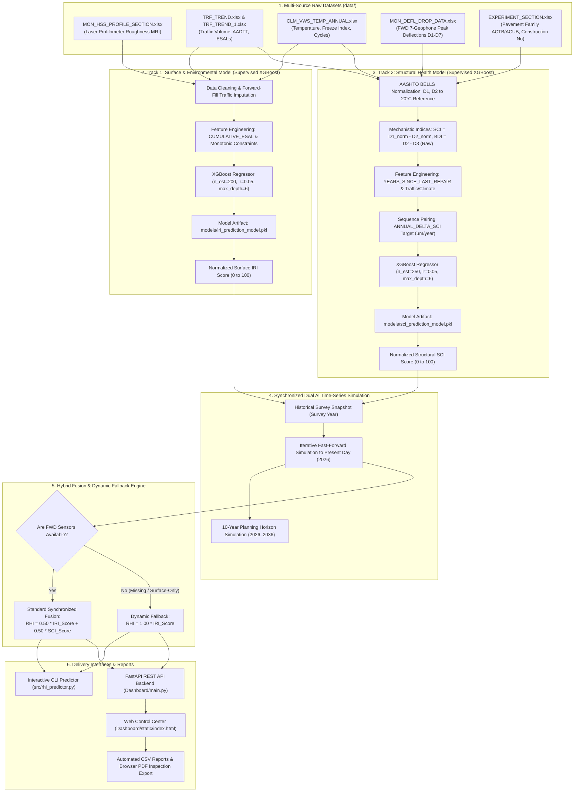

# 🛣️ Road Health Index (RHI) & Pavement Remaining Service Life Prediction System

> **An AI-powered synchronized dual-track machine learning platform that evaluates pavement surface roughness, heavy traffic loadings, climate stress cycles, and subsurface structural deflection curvature to predict pavement deterioration and guide proactive infrastructure maintenance.**

---

### 👥 Project Metadata & Academic Attribution
* **Academic Institution**: Acharya Institute of Technology
* **Department**: Department of Artificial Intelligence & Machine Learning (AI & ML)
* **Project Group**: Group 18
* **Project Guide**: Mr. Mohammed Tahir Mirji | Assistant Professor
* **Data Origin**: Long-Term Pavement Performance (LTPP) Database — US Federal Highway Administration (FHWA) & Virtual Weather Station (VWS) Climate Data

---

## 📑 Table of Contents
1. [Project Overview & Executive Summary](#1-project-overview--executive-summary)
   * [The Core Problem](#the-core-problem)
   * [The Machine Learning Solution](#the-machine-learning-solution)
   * [Key Engineering Concepts for Beginners](#key-engineering-concepts-for-beginners)
2. [System Architecture & Machine Learning Pipeline](#2-system-architecture--machine-learning-pipeline)
   * [Dual-Track Architecture Flowchart](#dual-track-architecture-flowchart)
   * [Track 1: Model 1 — Surface Roughness, Traffic & Climate (XGBoost Regressor)](#track-1-model-1--surface-roughness-traffic--climate-xgboost-regressor)
   * [Track 2: Model 2 — Structural Fatigue & Deflection Curvature (Supervised XGBoost Regressor)](#track-2-model-2--structural-fatigue--deflection-curvature-supervised-xgboost-regressor)
   * [Synchronized Dual AI Time-Series Simulation Engine](#synchronized-dual-ai-time-series-simulation-engine)
   * [The Fusion Engine: 50/50 Hybrid Index & Dynamic Fallback Architecture](#the-fusion-engine-5050-hybrid-index--dynamic-fallback-architecture)
3. [Mathematical Formulations & Scoring Logic](#3-mathematical-formulations--scoring-logic)
   * [AASHTO BELLS Temperature Correction Formulation](#aashto-bells-temperature-correction-formulation)
   * [Mechanistic Pavement Indices ($SCI$ & $BDI$)](#mechanistic-pavement-indices-sci--bdi)
   * [Model 1: Normalized IRI Surface Score Formula](#model-1-normalized-iri-surface-score-formula)
   * [Model 2: Normalized SCI Structural Score Formula](#model-2-normalized-sci-structural-score-formula)
   * [Composite Synchronized RHI Fusion Formula](#composite-synchronized-rhi-fusion-formula)
   * [Pavement Condition & Decision Matrix](#pavement-condition--decision-matrix)
4. [Repository Directory & File Structure](#4-repository-directory--file-structure)
5. [Exhaustive Codebase & Function Catalog](#5-exhaustive-codebase--function-catalog)
   * [Backend Scripts (`src/`)](#backend-scripts-src)
     * [`src/train_model1.py`](#srctrain_model1py)
     * [`src/train_model2.py`](#srctrain_model2py)
     * [`src/rhi_predictor.py`](#srcrhi_predictorpy)
   * [FastAPI Server & Control Center (`Dashboard/`)](#fastapi-server--control-center-dashboard)
     * [`Dashboard/main.py`](#dashboardmainpy)
   * [Frontend Application Stack (`Dashboard/static/`)](#frontend-application-stack-dashboardstatic)
     * [`Dashboard/static/index.html`](#dashboardstaticindexhtml)
     * [`Dashboard/static/app.js`](#dashboardstaticappjs)
     * [`Dashboard/static/styles.css`](#dashboardstaticstylescss)
     * [`Dashboard/static/advanced.css`](#dashboardstaticadvancedcss)
     * [`Dashboard/static/form-helpers.css`](#dashboardstaticform-helperscss)
   * [Research & Exploration Notebooks (`notebooks/`)](#research--exploration-notebooks-notebooks)
     * [`notebooks/model1.ipynb`](#notebooksmodel1ipynb)
     * [`notebooks/model2.ipynb`](#notebooksmodel2ipynb)
     * [`notebooks/RHI_Score.ipynb`](#notebooksrhi_scoreipynb)
   * [Verification & Testing (`testing/`)](#verification--testing-testing)
     * [`testing/test_suite.py`](#testingtest_suitepy)
   * [Datasets Catalog (`data/`)](#datasets-catalog-data)
   * [Trained Model Artifacts (`models/`)](#trained-model-artifacts-models)
   * [Generated Output Artifacts (`outputs/` & `outputs_test/`)](#generated-output-artifacts-outputs--outputs_test)
6. [REST API Documentation & Endpoints Reference](#6-rest-api-documentation--endpoints-reference)
7. [User Workflows & Operational Guides](#7-user-workflows--operational-guides)
   * [Workflow 1: Training Models from Scratch](#workflow-1-training-models-from-scratch)
   * [Workflow 2: Running the Interactive Terminal CLI Predictor](#workflow-2-running-the-interactive-terminal-cli-predictor)
   * [Workflow 3: Starting the Web Control Center Dashboard](#workflow-3-starting-the-web-control-center-dashboard)
   * [Workflow 4: Running the Automated Test Suite](#workflow-4-running-the-automated-test-suite)
   * [Workflow 5: Batch Assessment via Web UI](#workflow-5-batch-assessment-via-web-ui)
8. [Comprehensive Domain & Technical Glossary](#8-comprehensive-domain--technical-glossary)

---

## 1. Project Overview & Executive Summary

### The Core Problem
Highways and transportation networks deteriorate continuously under two interacting forces:
1. **Mechanical Axle Stress**: Heavy freight trucks and repetitive Equivalent Single Axle Loads (ESALs) induce tensile micro-strains at the bottom of the asphalt layer, leading to bottom-up fatigue cracking and base softening.
2. **Environmental & Thermal Stress**: Seasonal thermal contraction, sub-zero freeze indices, and annual freeze-thaw cycles expand trapped moisture by ~9%, fracturing the bitumen matrix and accelerating surface roughness.

Traditional road asset management relies heavily on periodic visual inspections and manual surveys, which suffer from major bottlenecks:
* **Subjective & Inconsistent**: Visual severity ratings vary widely between field technicians.
* **Hazardous & Slow**: Surveyors must walk or operate slow-moving vehicles across high-speed interstate corridors.
* **Reactive Instead of Proactive**: Repairs are initiated only after visible potholes and severe rutting occur, costing **3× to 5× more** than preventive preservation.
* **Structural Blindspot**: Surface-only visual surveys fail to detect subsurface base micro-fatigue before catastrophic failure breaks through.

### The Machine Learning Solution
This platform establishes an end-to-end, automated machine learning pipeline that computes a standardized **Road Health Index (RHI)** on a continuous scale from **0 to 100**.

By integrating **Non-Destructive Testing (NDT)** Falling Weight Deflectometer (FWD) sensor readings with high-speed laser profilometer scans, cumulative traffic trends, and Virtual Weather Station climate observations from the **FHWA Long-Term Pavement Performance (LTPP)** database, the platform:
1. **Track 1 (Surface AI)**: Predicts future International Roughness Index ($\text{FUTURE\_IRI}$) deterioration using an `XGBRegressor` trained on traffic damage and climate freeze-thaw cycles with monotonic physical constraints.
2. **Track 2 (Structural AI)**: Predicts the annualized structural degradation rate ($\text{ANNUAL\_DELTA\_SCI}$ in $\mu\text{m/year}$) using AASHTO BELLS temperature-normalized Surface Curvature Index ($SCI = D_{1,\text{norm}} - D_{2,\text{norm}}$) and raw Base Damage Index ($BDI = D_2 - D_3$) with a supervised `XGBRegressor`.
3. **Synchronized Dual AI Simulation Engine**: Compounding longitudinal deterioration step-by-step from historical survey year forward to **Present Day (2026)** and a **10-Year Planning Horizon (2026–2036)** with aging counters and virtual maintenance triggers.
4. **Dynamic Fallback Engine**: Fuses surface and structural scores into a balanced 50/50 RHI when FWD sensor data is available, with seamless 100% surface fallback for surface-only surveys.

```
                      ┌───────────────────────────────────────────────────────────┐
                      │              LTPP Multi-Source Raw Datasets               │
                      │  (Laser Profilers, Traffic Trends, FWD Sensors, Climate)  │
                      └─────────────────────────────┬─────────────────────────────┘
                                                    │
                         ┌──────────────────────────┴──────────────────────────┐
                         ▼                                                     ▼
        ┌───────────────────────────────────┐                 ┌───────────────────────────────────┐
        │   TRACK 1: SURFACE & CLIMATE AI   │                 │   TRACK 2: STRUCTURAL FATIGUE AI  │
        │   Supervised XGBoost Regressor    │                 │   Supervised XGBoost Regressor    │
        │   (MRI, ESALs, Trucks, Freeze)    │                 │   (SCI, BDI, Drop Load, Climate)  │
        └─────────────────┬─────────────────┘                 └─────────────────┬─────────────────┘
                          │                                                     │
                          │ Computes 0–100 IRI Score                            │ Computes 0–100 SCI Score
                          ▼                                                     ▼
        ┌─────────────────────────────────────────────────────────────────────────────────────────┐
        │                     SYNCHRONIZED DUAL AI TIME-SERIES SIMULATION ENGINE                  │
        │               Historical Snapshot  ──►  Step-by-Step Simulation  ──►  Present Day (2026)│
        │               Full Data: RHI = 50% IRI Score + 50% SCI Structural Score                 │
        │               Surface-Only Survey: RHI = 100% IRI Score (Dynamic Fallback)              │
        └───────────────────────────────────────────┬─────────────────────────────────────────────┘
                                                    │
                                                    ▼
        ┌─────────────────────────────────────────────────────────────────────────────────────────┐
        │             FINAL ROAD HEALTH INDEX (0–100) & ACTIONABLE CLASSIFICATION                 │
        │             🟢 Good (75–100)  |  🟡 Fair (50–74.9)  |  🔴 Poor (0–49.9)                 │
        └─────────────────────────────────────────────────────────────────────────────────────────┘
```

### Key Engineering Concepts for Beginners
* **NDT (Non-Destructive Testing)**: Methods used to evaluate pavement physical properties without drilling destructive core holes.
* **IRI (International Roughness Index)**: The worldwide gold standard metric quantifying longitudinal surface roughness in meters per kilometer ($\text{m/km}$). Values $> 2.5\text{ m/km}$ indicate a failed, rough surface.
* **MRI (Mean Roughness Index)**: The mathematical average of IRI values measured simultaneously in the left and right wheelpaths.
* **FWD (Falling Weight Deflectometer)**: Trailer-mounted testing equipment that drops a calibrated dynamic load onto a buffered plate and records peak surface deflections across 7 geophone sensors ($D_1$ to $D_7$ in microns, $\mu\text{m}$).
* **Deflection Basin**: The bowl-shaped depression formed across the 7 geophones during impact.
* **SCI (Surface Curvature Index)**: $SCI = D_1 - D_2$ ($\mu\text{m}$). Measures the steepness of the deflection basin between the load center ($0\text{ mm}$) and sensor 2 ($203\text{ mm}$ / $8\text{ in}$), directly isolating asphalt surface layer fatigue.
* **BDI (Base Damage Index)**: $BDI = D_2 - D_3$ ($\mu\text{m}$). Evaluates structural degradation within the base and subbase layers.
* **BELLS Temperature Correction**: AASHTO empirical formulation standardizing asphalt deflections to a uniform reference temperature ($20^\circ\text{C}$).
* **ESAL (Equivalent Single Axle Load)**: Converts mixed traffic (passenger cars, buses, heavy multi-axle semi-trucks) into the damaging equivalent of standard 18,000-pound (80 kN) single-axle passes.
* **Freeze-Thaw Cycle**: Freezing and thawing cycles of trapped moisture in pavement layers causing micro-fracturing.

---

## 2. System Architecture & Machine Learning Pipeline

### Dual-Track Architecture Flowchart


```mermaid
flowchart TD
    subgraph DataSources["1. Multi-Source Raw Datasets (data/)"]
        D1["MON_HSS_PROFILE_SECTION.xlsx<br/>(Laser Profilometer Roughness MRI)"]
        D2["TRF_TREND.xlsx & TRF_TREND_1.xlsx<br/>(Traffic Volume, AADTT, ESALs)"]
        D3["CLM_VWS_TEMP_ANNUAL.xlsx<br/>(Temperature, Freeze Index, Cycles)"]
        D4["MON_DEFL_DROP_DATA.xlsx<br/>(FWD 7-Geophone Peak Deflections D1-D7)"]
        D5["EXPERIMENT_SECTION.xlsx<br/>(Pavement Family ACTB/ACUB, Construction No)"]
    end

    subgraph Track1["2. Track 1: Surface & Environmental Model (Supervised XGBoost)"]
        P1["Data Cleaning & Forward-Fill Traffic Imputation"]
        P2["Feature Engineering: CUMULATIVE_ESAL & Monotonic Constraints"]
        P3["XGBoost Regressor (n_est=200, lr=0.05, max_depth=6)"]
        P4["Model Artifact: models/iri_prediction_model.pkl"]
        P5["Normalized Surface IRI Score (0 to 100)"]
        D1 & D2 & D3 --> P1 --> P2 --> P3 --> P4 --> P5
    end

    subgraph Track2["3. Track 2: Structural Health Model (Supervised XGBoost)"]
        S1["AASHTO BELLS Normalization: D1, D2 to 20°C Reference"]
        S2["Mechanistic Indices: SCI = D1_norm - D2_norm, BDI = D2 - D3 (Raw)"]
        S3["Feature Engineering: YEARS_SINCE_LAST_REPAIR & Traffic/Climate"]
        S4["Sequence Pairing: ANNUAL_DELTA_SCI Target (µm/year)"]
        S5["XGBoost Regressor (n_est=250, lr=0.05, max_depth=6)"]
        S6["Model Artifact: models/sci_prediction_model.pkl"]
        S7["Normalized Structural SCI Score (0 to 100)"]
        D4 & D5 & D2 & D3 --> S1 --> S2 --> S3 --> S4 --> S5 --> S6 --> S7
    end

    subgraph SimulationEngine["4. Synchronized Dual AI Time-Series Simulation"]
        SE1["Historical Survey Snapshot (Survey Year)"]
        SE2["Iterative Fast-Forward Simulation to Present Day (2026)"]
        SE3["10-Year Planning Horizon Simulation (2026–2036)"]
        P5 & S7 --> SE1 --> SE2 --> SE3
    end

    subgraph FusionEngine["5. Hybrid Fusion & Dynamic Fallback Engine"]
        F1{"Are FWD Sensors Available?"}
        F2["Standard Synchronized Fusion:<br/>RHI = 0.50 * IRI_Score + 0.50 * SCI_Score"]
        F3["Dynamic Fallback:<br/>RHI = 1.00 * IRI_Score"]
        SE2 --> F1
        F1 -- Yes --> F2
        F1 -- No (Missing / Surface-Only) --> F3
    end

    subgraph Delivery["6. Delivery Interfaces & Reports"]
        U1["Interactive CLI Predictor (src/rhi_predictor.py)"]
        U2["FastAPI REST API Backend (Dashboard/main.py)"]
        U3["Web Control Center (Dashboard/static/index.html)"]
        U4["Automated CSV Reports & Browser PDF Inspection Export"]
        F2 --> U1 & U2
        F3 --> U1 & U2
        U2 --> U3 --> U4
    end
```

---

### Track 1: Model 1 — Surface Roughness, Traffic & Climate (XGBoost Regressor)
* **Goal**: Predict the road's future surface roughness ($\text{FUTURE\_IRI}$) and convert the result into a normalized 0–100 Surface Score.
* **Algorithm**: Extreme Gradient Boosting (`XGBRegressor`) with monotonic constraints to preserve physical validity.
* **Monotonic Physical Constraints**: Monotonic constraints enforce that future roughness increases monotonically with current roughness ($\partial \text{FUTURE\_IRI} / \partial \text{MRI} \ge 0$) and cumulative loading ($\partial \text{FUTURE\_IRI} / \partial \text{CUMULATIVE\_ESAL} \ge 0$), preventing unrealistic pavement self-healing.
* **Features Used (9 Inputs)**:
  1. `MRI`: Mean Roughness Index ($\text{m/km}$)
  2. `AADTT_ALL_TRUCKS_TREND`: Average Annual Daily Truck Traffic (trucks/day)
  3. `ANNUAL_TRUCK_VOLUME_TREND`: Total yearly commercial truck count
  4. `ANNUAL_ESAL_TREND`: Yearly Equivalent Single Axle Load damage
  5. `CUMULATIVE_ESAL`: Engineered cumulative sum of all ESAL damage sustained since construction
  6. `YEAR`: Measurement calendar year
  7. `MEAN_ANN_TEMP_AVG`: Mean annual ambient temperature ($^\circ\text{C}$)
  8. `FREEZE_INDEX_YR`: Annual cumulative freezing degree-days ($^\circ\text{C}\cdot\text{days}$)
  9. `FREEZE_THAW_YR`: Annual number of freeze-thaw thermal cycles

---

### Track 2: Model 2 — Structural Fatigue & Deflection Curvature (Supervised XGBoost Regressor)
* **Goal**: Predict the annualized structural degradation rate via **$\text{ANNUAL\_DELTA\_SCI}$** ($\mu\text{m/year}$) and evaluate base condition via the **Base Damage Index ($BDI$)**.
* **Why Annualized Delta?** Tree-based models cannot extrapolate monotonic trends beyond training bounds; predicting absolute future SCI caused heavily damaged roads to artificially "heal" (mean reversion). Predicting the annual rate of change ($\Delta \text{SCI} / \Delta t$) guarantees realistic, forward physical deterioration.
* **AASHTO Temperature Normalization**: Raw asphalt deflections $D_1$ and $D_2$ are normalized to a standard $20^\circ\text{C}$ reference using the BELLS exponential correction:
  $$D_{20} = D_t \times 10^{-0.0079 \times (20 - T_{\text{pavement}})}$$
  This eliminates seasonal thermal softening bias before calculating the Surface Curvature Index ($SCI = D_{1,\text{norm}} - D_{2,\text{norm}}$).
* **BDI Kept Raw (No BELLS)**: Base Damage Index ($BDI = D_2 - D_3$) reflects structural behavior in granular base and subgrade soil layers, which are non-viscoelastic mineral aggregates and do not undergo asphalt-like thermal softening.
* **Continuous Unbroken Lifecycle**: The pipeline avoids artificial data fragmentation by tracking roads continuously across repairs rather than splitting by `CONSTRUCTION_NO`, adding a dynamic `YEARS_SINCE_LAST_REPAIR` feature.
* **Features Used (15 Inputs)**:
  1. `SCI`: Temperature-normalized Surface Curvature Index ($D_{1,\text{norm}} - D_{2,\text{norm}}$ in $\mu\text{m}$)
  2. `BDI`: Base Damage Index ($D_2 - D_3$ in $\mu\text{m}$, uncorrected raw deflections)
  3. `DROP_LOAD`: Applied dynamic impact force (~710 kN)
  4. `DROP_HEIGHT`: Height drop index (1 to 4)
  5. `PAVEMENT_FAMILY_ENC`: Encoded pavement structure (`ACTB` = Asphalt Concrete over Treated Base, `ACUB` = Untreated Base)
  6. `LANE_NO_ENC`: Encoded lane tested (`F1` = Outer Lane, `F3` = Inner Lane)
  7. `AADTT_ALL_TRUCKS_TREND`: Daily truck traffic
  8. `ANNUAL_TRUCK_VOLUME_TREND`: Annual truck traffic volume
  9. `ANNUAL_ESAL_TREND`: Annual ESAL loading
  10. `CUMULATIVE_ESAL`: Total accumulated structural loading
  11. `YEAR`: Measurement calendar year
  12. `YEARS_SINCE_LAST_REPAIR`: Calendar years elapsed since last construction or overlay event
  13. `MEAN_ANN_TEMP_AVG`: Mean annual temperature ($^\circ\text{C}$)
  14. `FREEZE_INDEX_YR`: Freezing index ($^\circ\text{C}\cdot\text{days}$)
  15. `FREEZE_THAW_YR`: Annual freeze-thaw cycles

---

### Synchronized Dual AI Time-Series Simulation Engine
Real-world inspection datasets frequently feature historic measurements (e.g., recorded in 2012 or 2018). The platform employs a **synchronized iterative step-wise engine** that compounds annual traffic loading and climate stress to project both surface roughness and structural fatigue to **Present Day (2026)** and across a **10-Year Planning Horizon (2026–2036)**.

At each yearly simulation step:
1. **Model 1** predicts $\text{IRI}_{t+1}$ using current surface condition, traffic, and climate. If the AI prediction indicates healing ($<\text{IRI}_t$), a data-driven physical deterioration rate ($\approx 0.04\text{ m/km/year}$) is applied as a lower clamp.
2. **Model 2** predicts the annualized degradation rate $\widehat{\Delta \text{SCI}}$ using current structural condition, traffic, climate, and `YEARS_SINCE_LAST_REPAIR`.
   * **Bounded Physical Decay**: The annual deterioration is bounded to realistic AASHTO envelope rates: $\text{annual\_degradation} = \max(1.5, \min(\widehat{\Delta \text{SCI}}, 8.0))$. If an error occurs, a physics-backed calibrated default of $4.2\ \mu\text{m/year}$ is used.
   * **Delta Addition**: $\text{SCI}_{t+1} = \text{SCI}_t + \text{annual\_degradation}$.
   * **Aging Counter**: `YEARS_SINCE_LAST_REPAIR` increments by $+1$ each simulated year.
   * **Virtual Maintenance Trigger**: If simulated $\text{SCI}_{t+1} > 150.0\ \mu\text{m}$ (critical structural failure threshold), the system simulates a physical asphalt overlay by resetting $\text{SCI}_{t+1} \to 40.0\ \mu\text{m}$ (fresh overlay baseline), resetting `YEARS_SINCE_LAST_REPAIR` $\to 0$, and reducing Base Damage Index by 50% ($BDI \times 0.5$) to simulate structural base restoration.
3. Cumulative ESALs compound annually: $\text{CUMULATIVE\_ESAL}_{t+1} = \text{CUMULATIVE\_ESAL}_t + \text{ANNUAL\_ESAL}$.

---

### The Fusion Engine: 50/50 Hybrid Index & Dynamic Fallback Architecture
* **Full Inspection (Both Surface IRI and FWD Deflections available)**:
  $$\text{RHI} = \left(0.50 \times \text{IRI\_Score}\right) + \left(0.50 \times \text{SCI\_Score}\right)$$
* **Surface-Only Inspection (FWD unavailable or lane-closure not feasible)**:
  $$\text{RHI} = 1.00 \times \text{IRI\_Score} \quad (\text{Dynamic Fallback Engaged})$$

This guarantees **100% network segment coverage** without discarding valid surface scans.

---

## 3. Mathematical Formulations & Scoring Logic

### AASHTO BELLS Temperature Correction Formulation
Asphalt concrete is a viscoelastic composite material whose dynamic stiffness modulus decreases exponentially as pavement temperature increases. Deflections recorded under summer heat would artificially suggest structural failure, while deflections recorded in winter would falsely suggest excessive structural capacity.

To normalize deflections to an AASHTO standard reference temperature ($T_{\text{ref}} = 20^\circ\text{C}$), the platform applies the exponential **BELLS** temperature correction formula to the surface deflections $D_1$ and $D_2$:

$$D_{20} = D_t \times 10^{-0.0079 \times (20 - T_{\text{pavement}})}$$

Where:
* $D_t$: Field-measured peak deflection at pavement temperature $T_{\text{pavement}}$ ($\mu\text{m}$).
* $D_{20}$: Normalized deflection standardized to $20^\circ\text{C}$ ($\mu\text{m}$).
* $-0.0079$: Standard AASHTO empirical temperature sensitivity exponent for dense-graded asphalt concrete.

#### BELLS Correction Multiplier Reference Table

| Pavement Temperature ($T_{\text{pavement}}$) | Temperature Delta $(20 - T)$ | Multiplier Factor ($10^{-0.0079 \times (20 - T)}$) | Physical Interpretation & Normalization Impact |
| :---: | :---: | :---: | :--- |
| **$5^\circ\text{C}$** | $+15^\circ\text{C}$ | **$0.761$** | Cold, brittle pavement; deflections are artificially low and scaled upward to $20^\circ\text{C}$ equivalent. |
| **$10^\circ\text{C}$** | $+10^\circ\text{C}$ | **$0.834$** | Stiff asphalt; adjusted to eliminate winter hardening bias. |
| **$15^\circ\text{C}$** | $+5^\circ\text{C}$ | **$0.913$** | Cool pavement; normalized toward standard laboratory conditions. |
| **$20^\circ\text{C}$** | $0^\circ\text{C}$ | **$1.000$** | **AASHTO Reference Standard**: Deflection passes through unchanged ($1.000\times$). |
| **$25^\circ\text{C}$** | $-5^\circ\text{C}$ | **$1.095$** | Warm pavement; thermal expansion and softening effects scaled downward. |
| **$30^\circ\text{C}$** | $-10^\circ\text{C}$ | **$1.200$** | Hot asphalt; removes summer thermal softening to prevent false structural failure diagnosis. |
| **$35^\circ\text{C}$** | $-15^\circ\text{C}$ | **$1.314$** | Extreme summer heat; substantial damping of thermal softening bias. |
| **$40^\circ\text{C}$** | $-20^\circ\text{C}$ | **$1.439$** | Severe pavement heating; corrected back to mechanical structural baseline. |

> [!NOTE]
> **Why Base Damage Index ($BDI$) is NOT Temperature-Normalized**:
> Base Damage Index ($BDI = D_2 - D_3$) reflects structural behavior in granular base, crushed aggregate subbase, and natural subgrade soil layers. Because unbound aggregate and soil matrices are non-viscoelastic mineral materials, they do not experience temperature-dependent stiffness softening. Applying asphalt temperature corrections to deeper geophones ($D_3$) would distort subgrade assessment.

---

### Mechanistic Pavement Indices ($SCI$ & $BDI$)
$$\text{SCI} = D_{1,\text{norm}} - D_{2,\text{norm}} \quad (\mu\text{m})$$
$$\text{BDI} = D_2 - D_3 \quad (\mu\text{m}) \quad [\text{Raw Deflections}]$$
* $D_{1,\text{norm}}$: BELLS temperature-normalized peak deflection at load plate center ($0\text{ mm}$).
* $D_{2,\text{norm}}$: BELLS temperature-normalized peak deflection at sensor offset $203\text{ mm}$ ($8\text{ in}$).
* $D_2, D_3$: Raw uncorrected peak deflections at sensor offsets $203\text{ mm}$ and $305\text{ mm}$ ($12\text{ in}$).

---

### Model 1: Normalized IRI Surface Score Formula
The Federal Highway Administration (FHWA) defines an IRI $\ge 2.5\text{ m/km}$ as critical surface failure. The continuous 0–100 surface score is computed as:

$$\text{IRI\_Score} = \text{clip}\left( \frac{2.5 - \text{IRI}}{2.5} \times 100, \quad 0, \quad 100 \right)$$

* $\text{IRI} = 0.0\text{ m/km}$ (glass-smooth): $\text{Score} = 100.0$
* $\text{IRI} = 1.25\text{ m/km}$ (good highway): $\text{Score} = 50.0$
* $\text{IRI} \ge 2.5\text{ m/km}$ (severely deteriorated): $\text{Score} = 0.0$

---

### Model 2: Normalized SCI Structural Score Formula
A Surface Curvature Index $\text{SCI} \ge 200.0\ \mu\text{m}$ indicates extensive upper asphalt fatigue micro-cracking and loss of tensile stiffness. The continuous 0–100 structural score is computed as:

$$\text{SCI\_Score} = \text{clip}\left( \frac{200.0 - \text{SCI}}{200.0} \times 100, \quad 0, \quad 100 \right)$$

#### Key Reference Points & Calibration Targets

| SCI Value ($\mu\text{m}$) | Structural SCI Score | Physical & Operational Significance |
| :---: | :---: | :--- |
| $\le 0.0\ \mu\text{m}$ | **$100.0$** | Theoretical maximum rigidity / unyielding structural slab. |
| **$40.0\ \mu\text{m}$** | **$80.0$** | **Fresh Asphalt Overlay Baseline**; standard benchmark applied after rehabilitation. |
| $50.0\ \mu\text{m}$ | **$75.0$** | Sound, elastic asphalt; preventive crack sealing and routine preservation range. |
| **$100.0\ \mu\text{m}$** | **$50.0$** | Moderate fatigue cracking; onset of upper-layer stiffness degradation. |
| **$150.0\ \mu\text{m}$** | **$25.0$** | **Critical Structural Failure Threshold**; triggers virtual maintenance overlay ($SCI \to 40\ \mu\text{m}$). |
| $\ge 200.0\ \mu\text{m}$ | **$0.0$** | Terminal structural failure; complete fatigue fracture across asphalt layer. |

---

### Composite Synchronized RHI Fusion Formula
$$\text{RHI} = \begin{cases} 
0.50 \times \text{IRI\_Score} + 0.50 \times \text{SCI\_Score} & \text{if FWD sensor data is available} \\[8pt]
1.00 \times \text{IRI\_Score} & \text{if FWD sensor data is missing (Dynamic Fallback)}
\end{cases}$$

---

### Pavement Condition & Decision Matrix

| RHI Score Range | Condition Rating | Structural & Surface Status | Recommended Engineering Action |
| :---: | :---: | :--- | :--- |
| **75.0 – 100.0** | 🟢 **Good** | High structural integrity ($\text{SCI} \le 50\ \mu\text{m}$) and smooth surface ($\text{IRI} < 1.5\text{ m/km}$). | Routine inspection, crack sealing, and preventive surface preservation treatments. |
| **50.0 – 74.9** | 🟡 **Fair** | Moderate surface wear ($\text{IRI } 1.5–2.5\text{ m/km}$) or early micro-fatigue ($\text{SCI } 50–100\ \mu\text{m}$). | Schedule thin asphalt overlay, micro-surfacing, or targeted milling and localized base patching. |
| **0.0 – 49.9** | 🔴 **Poor** | Severe roughness ($\text{IRI} > 2.5\text{ m/km}$) or critical structural base fatigue ($\text{SCI} > 100\ \mu\text{m}$). | Immediate structural rehabilitation, full-depth reclamation (FDR), or complete reconstruction. |

---

## 4. Repository Directory & File Structure

```
Road-RSL-Prediction/
│
├── Dashboard/                      # Web Application & REST API Service
│   ├── main.py                     # FastAPI Backend Server & Prediction Service
│   └── static/                     # Frontend Assets (HTML5, Vanilla JS, CSS3)
│       ├── index.html              # Dashboard User Interface Layout
│       ├── app.js                  # Frontend Application Logic & Chart.js Controllers
│       ├── styles.css              # Base Modern Design System & Theme Variables
│       ├── advanced.css            # Advanced Responsive Grid, PDF & Gauge Styling
│       └── form-helpers.css        # Interactive Form Control & Switch Helpers
│
├── data/                           # Raw LTPP & Virtual Weather Station Datasets
│   ├── CLM_VWS_TEMP_ANNUAL.xlsx    # Climate Data (Annual Mean Temp, Freeze Index, Freeze-Thaw)
│   ├── EXPERIMENT_SECTION.xlsx     # Section Metadata & Pavement Family Specifications
│   ├── MON_DEFL_DROP_DATA.xlsx     # Falling Weight Deflectometer (FWD) Sensor Deflections
│   ├── MON_HSS_PROFILE_SECTION.xlsx# High-Speed Profilometer Surface Roughness (MRI) Scans
│   ├── TRF_TREND.xlsx              # Traffic Damage Trend (Annual ESAL Loads)
│   ├── TRF_TREND_1.xlsx            # Traffic Volume Trend (Daily AADTT & Annual Truck Volume)
│   └── processed_network_cache.pkl # In-Memory Preprocessed Cache for Fast Server Start
│
├── models/                         # Serialized Machine Learning & Preprocessing Artifacts
│   ├── iri_prediction_model.pkl    # Trained XGBoost Regressor for Surface Roughness (IRI)
│   ├── deterioration_rate.txt      # Data-Driven Annual Surface Degradation Fallback Rate (~0.04 m/km/year)
│   ├── sci_prediction_model.pkl    # Trained Supervised XGBoost Regressor for Annual Delta SCI (µm/year)
│   ├── sci_le_pav.pkl              # Fitted LabelEncoder for Pavement Family
│   ├── sci_le_lane.pkl             # Fitted LabelEncoder for Lane Designation
│   └── sci_deterioration_rate.txt  # Calibrated Physical Structural Degradation Fallback Rate (4.2 µm/year)
│
├── notebooks/                      # Exploratory Data Analysis & Model Training Notebooks
│   ├── model1.ipynb                # Supervised Model 1 Development (IRI XGBoost Regressor)
│   ├── model2.ipynb                # Supervised Model 2 Development (Structural SCI XGBoost)
│   └── RHI_Score.ipynb             # Master Dual-Track Synchronized Pipeline & Network Analysis
│
├── outputs/                        # Master Scored Datasets & Validation Plots
│   ├── model1_predictions.csv      # Scored Model 1 Longitudinal Forecasts
│   ├── rhi_scores.csv              # Master Scored Dataset for all 502 LTPP Road Sections
│   └── Road_Health_Index_Project_Guide.pdf # Official Project Architectural Guidebook
│
├── outputs_test/                   # Verification Test Outputs
│   └── sample_prediction.csv       # Scored Output from Standalone Verification Test Suite
│
├── src/                            # Production Python Scripts
│   ├── train_model1.py             # CLI Script to Clean Data & Train Supervised Model 1 (IRI)
│   ├── train_model2.py             # CLI Script to Clean Data & Train Supervised Model 2 (Annual Delta SCI)
│   └── rhi_predictor.py            # Interactive Terminal CLI Predictor for Custom Roads
│
├── testing/                        # Automated Testing & Verification
│   ├── test_suite.py               # Comprehensive Pytest Suite (20 Unit & Integration Tests across 6 Classes)
│   └── test_rhi_score.ipynb        # Standalone Verification Test Suite Notebook
│
├── requirements.txt                # Unified Python Dependencies Specification
├── SETUP.md                        # Step-by-Step Beginner Setup & Installation Manual
├── explain.md                      # Executive Project Summary & Defense Q&A Guide
└── README.md                       # Comprehensive Project Documentation & Technical Reference
```

---

## 5. Exhaustive Codebase & Function Catalog

### Backend Scripts (`src/`)

#### [`src/train_model1.py`](src/train_model1.py)
* **File Purpose**: Ingests high-speed laser profilometer scans, multi-year traffic series, and climate temperature records. Preprocesses longitudinal trends, engineers `CUMULATIVE_ESAL` and target `FUTURE_IRI`, fits an `XGBRegressor` with monotonic constraints, calculates the statistical fallback degradation rate, and serializes artifacts to `models/`.
* **Execution**: `python src/train_model1.py`

#### [`src/train_model2.py`](src/train_model2.py)
* **File Purpose**: Ingests Falling Weight Deflectometer (FWD) peak deflection basins ($D_1$ through $D_7$), applies AASHTO BELLS temperature normalization ($20^\circ\text{C}$) to $D_1$ and $D_2$, calculates mechanistic indices ($SCI = D_{1,\text{norm}} - D_{2,\text{norm}}$, $BDI = D_2 - D_3$), engineers `YEARS_SINCE_LAST_REPAIR`, pairs consecutive drops to create ground-truth `ANNUAL_DELTA_SCI` targets ($\mu\text{m/year}$), trains a supervised `XGBRegressor`, and serializes `sci_prediction_model.pkl`, encoders, and fallback rates ($4.2\ \mu\text{m/year}$).
* **Execution**: `python src/train_model2.py`

#### [`src/rhi_predictor.py`](src/rhi_predictor.py)
* **File Purpose**: Interactive command-line terminal predictor that prompts the user for surface roughness, traffic, climate, and optional FWD deflections, applies BELLS temperature correction, calculates Historical Snapshot RHI, executes synchronized fast-forward simulation to 2026, and prints an executive diagnostic report.
* **Execution**: `python src/rhi_predictor.py`

---

### FastAPI Server & Control Center (`Dashboard/`)

#### [`Dashboard/main.py`](Dashboard/main.py)
* **File Purpose**: Asynchronous FastAPI server exposing REST API endpoints for live road simulation, SHAP feature importance explanations, 10-year projections, section searching, batch CSV assessment, and serving frontend assets.

| Function / Component | Signature | Architectural Purpose & Docstring Summary |
| :--- | :--- | :--- |
| `score_iri` | `(iri_val: float) -> float` | Evaluates surface condition by mapping IRI to a continuous 0–100 scale using FHWA criteria ($2.5\text{ m/km}$ failure threshold). |
| `score_sci` | `(sci_val: float) -> float` | Evaluates structural health by mapping Surface Curvature Index ($SCI$) to a 0–100 scale ($200.0\ \mu\text{m}$ failure threshold). |
| `bells_temperature_correction` | `(deflection: float, temp_c: float) -> float` | AASHTO BELLS exponential correction formula standardizing asphalt deflections to a $20^\circ\text{C}$ reference temperature. |
| `calculate_indices` | `(deflections: list[float], temp_c: float) -> tuple[float, float]` | Computes temperature-normalized $SCI$ ($D_{1,\text{norm}} - D_{2,\text{norm}}$) and raw uncorrected $BDI$ ($D_2 - D_3$). |
| `load_artifacts` | `() -> dict[str, Any]` | Caches trained models, fallback degradation rates, and label encoders in memory. |
| `lifespan` | `(app: FastAPI)` | FastAPI asynchronous lifespan context manager managing startup artifact preloading and in-memory cache lifecycle. |
| `predict` | `(payload: PredictionInput) -> dict[str, Any]` | Dual-timeline simulation engine executing historical snapshot assessment, 2026 fast-forward simulation, SHAP impact breakdown, and 10-year projection. |
| `batch_predict` | `(file: UploadFile) -> Response` | Validates, normalizes, and scores up to 50 uploaded road records, streaming back an enriched assessment CSV file. |

---

### Frontend Application Stack (`Dashboard/static/`)

* [`Dashboard/static/index.html`](Dashboard/static/index.html): Semantic layout featuring interactive sidebar parameters, FWD geophone inputs, radial SVG health gauge, component breakdown charts, 10-year deterioration timelines, batch upload, and random test sample verification.
* [`Dashboard/static/app.js`](Dashboard/static/app.js): Reactive client-side logic controlling asynchronous API communication, SVG gauge animation, Chart.js graphs, and client-side PDF assessment export.
* [`Dashboard/static/styles.css`](Dashboard/static/styles.css), [`advanced.css`](Dashboard/static/advanced.css), [`form-helpers.css`](Dashboard/static/form-helpers.css): Modern emerald/dark theme design system with responsive card layouts and glassmorphism styling.

---

### Research & Exploration Notebooks (`notebooks/`)

* [`notebooks/model1.ipynb`](notebooks/model1.ipynb): Step-by-step development and validation of Model 1 (Surface IRI XGBoost Regressor).
* [`notebooks/model2.ipynb`](notebooks/model2.ipynb): Development and validation of Model 2 (Supervised Structural SCI & BDI XGBoost Regressor with BELLS correction).
* [`notebooks/RHI_Score.ipynb`](notebooks/RHI_Score.ipynb): Master integration pipeline performing network-wide synchronized simulations and exporting `outputs/rhi_scores.csv`.

---

### Verification & Testing (`testing/`)

#### [`testing/test_suite.py`](testing/test_suite.py)
* **File Purpose**: Production automated pytest verification suite containing **20 comprehensive unit and integration tests** organized across 6 test classes to validate civil engineering formulas, machine learning inference, simulation mechanics, and API endpoints:

| Test Class | Tests Count | Scope & Verification Checks |
| :--- | :---: | :--- |
| `TestBellsCorrection` | 4 tests | Validates BELLS temperature correction at cold ($5^\circ\text{C}$), standard ($20^\circ\text{C}$), hot ($35^\circ\text{C}$), and negative temperatures. |
| `TestMechanisticIndices` | 3 tests | Validates $SCI$ and $BDI$ computation, verifies raw BDI is uncorrected, and checks boundary behaviors. |
| `TestScoringFormulas` | 4 tests | Validates piecewise linear mapping and clipping bounds for `score_iri` and `score_sci`. |
| `TestModelInference` | 3 tests | Tests Model 1 (IRI) and Model 2 (annualized delta SCI) inference validity and monotonic behavior. |
| `TestFastForwardSimulation` | 3 tests | Validates step-by-step iterative compounding, bounded physical decay ($1.5–8.0\ \mu\text{m/year}$), and virtual overlay trigger ($SCI > 150 \to 40$). |
| `TestAPIEndpoints` | 3 tests | Validates `/api/health`, `/api/metadata`, and `/api/batch-template.csv` response status and content headers. |

* **Execution**: `pytest testing/test_suite.py -v`

---

### Datasets Catalog (`data/`)

| Dataset Filename | Key Features | Description |
| :--- | :--- | :--- |
| **`MON_HSS_PROFILE_SECTION.xlsx`** | `SHRP_ID`, `STATE_CODE`, `CONSTRUCTION_NO`, `VISIT_DATE`, `MRI` | High-speed profilometer laser scans measuring Mean Roughness Index ($\text{m/km}$). |
| **`TRF_TREND_1.xlsx`** | `SHRP_ID`, `STATE_CODE`, `CONSTRUCTION_NO`, `YEAR`, `AADTT_ALL_TRUCKS_TREND`, `ANNUAL_TRUCK_VOLUME_TREND` | Yearly truck volume trends and daily freight traffic counts. |
| **`TRF_TREND.xlsx`** | `SHRP_ID`, `STATE_CODE`, `CONSTRUCTION_NO`, `YEAR`, `ANNUAL_ESAL_TREND` | Yearly Equivalent Single Axle Load (ESAL) structural damage metrics. |
| **`CLM_VWS_TEMP_ANNUAL.xlsx`** | `SHRP_ID`, `STATE_CODE`, `YEAR`, `MEAN_ANN_TEMP_AVG`, `FREEZE_INDEX_YR`, `FREEZE_THAW_YR` | Virtual Weather Station climate observations tracking thermal stress and freeze cycles. |
| **`MON_DEFL_DROP_DATA.xlsx`** | `SHRP_ID`, `STATE_CODE`, `CONSTRUCTION_NO`, `PEAK_DEFL_1`–`PEAK_DEFL_7`, `DROP_LOAD`, `DROP_HEIGHT`, `LANE_NO` | Falling Weight Deflectometer (FWD) sensor readings measuring deflection basins under dynamic load. |
| **`EXPERIMENT_SECTION.xlsx`** | `SHRP_ID`, `STATE_CODE`, `CONSTRUCTION_NO`, `PAVEMENT_FAMILY` | Structural metadata indicating pavement construction type (`ACTB` vs `ACUB`). |

---

### Trained Model Artifacts (`models/`)

| Artifact Name | Object Type | Description |
| :--- | :--- | :--- |
| **`iri_prediction_model.pkl`** | `xgboost.XGBRegressor` | Trained gradient boosted model predicting future roughness ($\text{m/km}$) with monotonic physical constraints. |
| **`deterioration_rate.txt`** | `float` | Data-driven median annual surface degradation fallback rate ($\approx 0.04\text{ m/km/year}$). |
| **`sci_prediction_model.pkl`** | `xgboost.XGBRegressor` | Trained supervised gradient boosted model predicting annualized rate of structural fatigue change (`ANNUAL_DELTA_SCI` in $\mu\text{m/year}$). |
| **`sci_le_pav.pkl`** | `sklearn.preprocessing.LabelEncoder` | Categorical encoder for pavement families (`ACTB`, `ACUB`). |
| **`sci_le_lane.pkl`** | `sklearn.preprocessing.LabelEncoder` | Categorical encoder for test lane designations (`F1`, `F3`). |
| **`sci_deterioration_rate.txt`** | `float` | Calibrated physical structural degradation fallback rate ($4.2\ \mu\text{m/year}$). |

---

### Generated Output Artifacts (`outputs/` & `outputs_test/`)

* [`outputs/rhi_scores.csv`](outputs/rhi_scores.csv): Master scored database containing calculated IRI scores, SCI structural scores, final RHI scores, and condition classifications for all 502 LTPP road sections across historical survey dates and 2026 present day.
* [`outputs/model1_predictions.csv`](outputs/model1_predictions.csv): Intermediate dataset containing cleaned longitudinal surface roughness trends and forward forecasts.
* [`outputs_test/sample_prediction.csv`](outputs_test/sample_prediction.csv): Verification output generated by the standalone test notebook.

---

## 6. REST API Documentation & Endpoints Reference

When the FastAPI server is running, interactive Swagger UI documentation is accessible at **`http://127.0.0.1:8000/docs`**, and alternative ReDoc documentation is available at **`http://127.0.0.1:8000/redoc`**.

### Summary of REST Endpoints

| HTTP Method | Endpoint Path | Query / Body Parameters | Purpose |
| :---: | :--- | :--- | :--- |
| `GET` | `/api/health` | None | Server health-check / liveness probe. |
| `GET` | `/api/metadata` | None | Returns supported categorical lists for Pavement Families and Lanes. |
| `GET` | `/api/sections` | `search` (str), `limit` (int) | Autocomplete search for road sections by SHRP ID or state code. |
| `GET` | `/api/section/{shrp_id}` | `state_code` (str, required) | Returns historic data, deflection basin, and defaults for a selected road segment. |
| `GET` | `/api/network-summary` | None | Aggregates network condition distribution for chart visualization. |
| `GET` | `/api/batch-template.csv` | None | Downloads a pre-formatted CSV template file with required headers for batch evaluation. |
| `POST` | `/api/predict` | JSON body (`PredictionInput`) | Real-time prediction with dual-timeline simulation, SHAP explanations, and 10-year projection. |
| `POST` | `/api/report.csv` | JSON body (`PredictionInput`) | Generates and streams a downloadable CSV assessment report. |
| `POST` | `/api/batch` | `multipart/form-data` (`file`) | Evaluates up to 50 road records from an uploaded CSV/Excel file. |

---

### Example Live Prediction Request & Response

#### `POST /api/predict`

**Request Body (JSON)**:
```json
{
  "mri": 0.85,
  "aadtt": 950.0,
  "annual_truck_volume": 346750.0,
  "annual_esal": 310000.0,
  "cumulative_esal": 1500000.0,
  "year": 2018,
  "mean_ann_temp_avg": 12.5,
  "freeze_index_yr": 3500.0,
  "freeze_thaw_yr": 240.0,
  "fwd_available": true,
  "deflections": [450.0, 280.0, 210.0, 180.0, 140.0, 110.0, 70.0],
  "drop_load": 710.0,
  "drop_height": 4,
  "pavement_family": "ACUB",
  "lane_no": "F3"
}
```

**Response Body (JSON)**:
```json
{
  "historical_snapshot": {
    "year": 2018,
    "measured_iri": 0.85,
    "iri_score": 66.0,
    "measured_sci": 145.9,
    "sci_score": 27.1,
    "rhi": 46.5,
    "condition": "Poor",
    "fwd_health": "Poor",
    "fwd_available": true
  },
  "present_estimation": {
    "year": 2026,
    "simulated_years": 8,
    "predicted_future_iri": 1.17,
    "iri_change": 0.32,
    "iri_score": 53.2,
    "predicted_future_sci": 179.5,
    "sci_change": 33.6,
    "sci_score": 10.3,
    "rhi": 31.7,
    "condition": "Poor",
    "structural_policy": "Synchronized 50/50 Dual AI Forecast"
  },
  "explanation": [
    { "feature": "Cumulative Esal", "impact_percent": 38.4, "direction": "accelerates deterioration" },
    { "feature": "Mri", "impact_percent": 29.1, "direction": "accelerates deterioration" }
  ],
  "simulation_path": [
    { "year": 2018, "iri": 0.85, "sci": 145.9, "rhi": 46.5, "condition": "Poor" },
    { "year": 2022, "iri": 1.01, "sci": 162.7, "rhi": 39.1, "condition": "Poor" },
    { "year": 2026, "iri": 1.17, "sci": 179.5, "rhi": 31.7, "condition": "Poor" }
  ],
  "projection": [
    { "year": 2026, "iri": 1.17, "iri_score": 53.2, "sci": 179.5, "sci_score": 10.3, "rhi": 31.7 },
    { "year": 2036, "iri": 1.85, "iri_score": 26.0, "sci": 40.0, "sci_score": 80.0, "rhi": 53.0 }
  ]
}
```

---

## 7. User Workflows & Operational Guides

### Workflow 1: Training Models from Scratch
```powershell
# 1. Train Model 1 (Surface Roughness & Climate XGBoost with Monotonic Constraints)
python src/train_model1.py

# 2. Train Model 2 (Supervised Structural Annual Delta SCI & BDI XGBoost with BELLS Correction)
python src/train_model2.py
```

### Workflow 2: Running the Interactive Terminal CLI Predictor
```powershell
python src/rhi_predictor.py
```

### Workflow 3: Starting the Web Control Center Dashboard
```powershell
python -m uvicorn Dashboard.main:app --reload --port 8000
```
Open your browser at **`http://127.0.0.1:8000`**.

### Workflow 4: Running the Automated Test Suite
```powershell
# Execute all 20 unit and integration tests across 6 test classes
pytest testing/test_suite.py -v
```

### Workflow 5: Batch Assessment via Web UI
1. Navigate to the **Batch Assessment** section on the web dashboard at `http://127.0.0.1:8000`.
2. Click **Download Template** (or query `/api/batch-template.csv`) to receive the pre-formatted schema.
3. Populate up to 50 road segment records with surface, traffic, climate, and optional geophone readings.
4. Upload the `.csv` or `.xlsx` file via drag-and-drop or file selector.
5. The backend executes dual-track simulations for each record and automatically initiates a browser download of the enriched results CSV.

---

## 8. Comprehensive Domain & Technical Glossary

* **AADTT (Average Annual Daily Truck Traffic)**: Total commercial freight trucks traveling across a road segment in an average 24-hour period.
* **ANNUAL_DELTA_SCI**: Annualized rate of change in Surface Curvature Index ($\mu\text{m/year}$), eliminating boundary mean-reversion and ensuring physically realistic forward deterioration.
* **BDI (Base Damage Index)**: Mechanistic structural index ($D_2 - D_3$ in $\mu\text{m}$) evaluating base and subbase layer degradation using raw uncorrected deflections.
* **BELLS Temperature Correction**: AASHTO empirical exponential formulation standardizing asphalt deflections ($D_1$ and $D_2$) to a uniform $20^\circ\text{C}$ reference to eliminate seasonal softening distortion.
* **Deflection Basin**: The curvature formed across the 7 geophone sensors ($D_1$ through $D_7$) under Falling Weight Deflectometer impact.
* **Dynamic Fallback**: Fault-tolerant architecture shifting RHI scoring to 100% surface roughness when subsurface geophone testing is unavailable.
* **ESAL (Equivalent Single Axle Load)**: Standardized unit converting mixed axle traffic into equivalent 18,000 lb (80 kN) single-axle damage passes.
* **Falling Weight Deflectometer (FWD)**: Non-destructive dynamic testing device recording surface deflection basins under impulse load.
* **FastAPI**: High-performance modern asynchronous Python web framework.
* **Forward-Fill Imputation (`ffill`)**: Longitudinal time-series data preparation technique carrying forward the last known valid observation.
* **International Roughness Index (IRI)**: Standardized scale ($\text{m/km}$) quantifying pavement surface roughness affecting ride quality.
* **Mean Roughness Index (MRI)**: The average of IRI values measured concurrently in the inner and outer wheelpaths.
* **Monotone Constraints**: Mathematical constraints applied during gradient boosting training that force predicted deterioration to increase monotonically with initial roughness and cumulative traffic load.
* **Non-Destructive Testing (NDT)**: Structural evaluation methods that do not cause physical damage to the infrastructure asset.
* **Remaining Service Life (RSL)**: Estimated years before a pavement reaches the critical terminal failure threshold ($2.5\text{ m/km}$).
* **Road Health Index (RHI)**: Standardized 0–100 index combining surface ride quality, traffic loading, climate stress, and structural deflection stiffness.
* **SCI (Surface Curvature Index)**: Mechanistic structural index ($D_1 - D_2$ in $\mu\text{m}$) isolating upper asphalt fatigue cracking.
* **SHAP (SHapley Additive exPlanations)**: Game-theoretic technique explaining individual feature impact contributions to machine learning predictions.
* **Virtual Maintenance Trigger**: Simulation mechanism that detects when structural fatigue exceeds the critical threshold ($SCI > 150.0\ \mu\text{m}$), automatically simulating an asphalt overlay by resetting $SCI \to 40.0\ \mu\text{m}$, reducing $BDI$ by 50%, and resetting repair age to 0.
* **XGBoost (Extreme Gradient Boosting)**: Optimized gradient boosting framework implementing regularized decision tree ensembles.
* **YEARS_SINCE_LAST_REPAIR**: Feature tracking calendar years elapsed since the pavement was built or rehabilitated, supporting continuous unbroken life-cycle simulation across maintenance events.

---

### 📘 Setup & Installation Manual
For step-by-step setup, virtual environments, and commands on Windows, macOS, or Linux, see **[`SETUP.md`](SETUP.md)**.